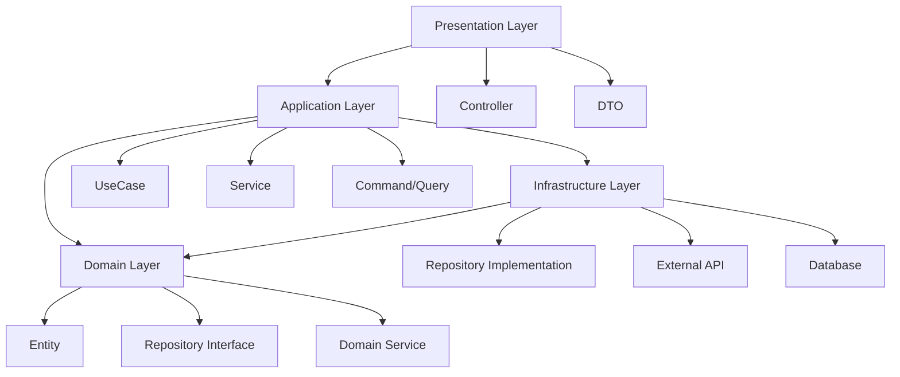
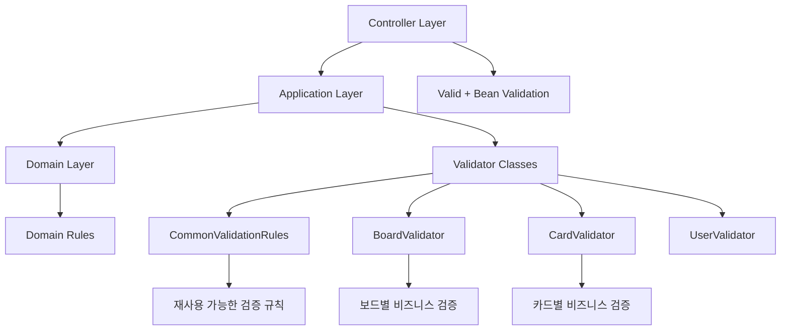
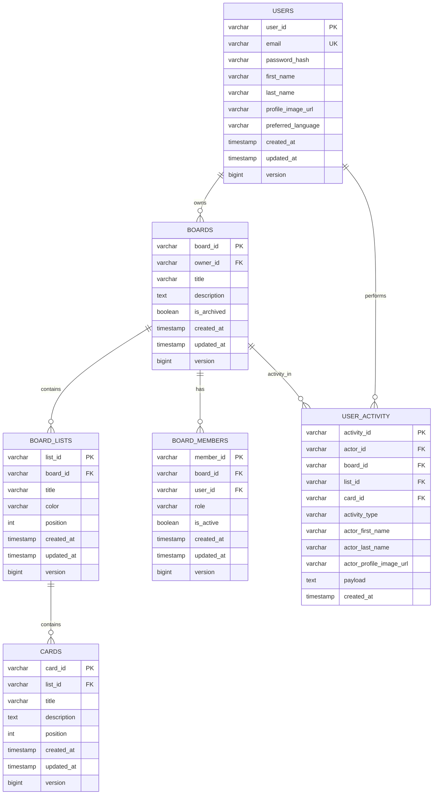
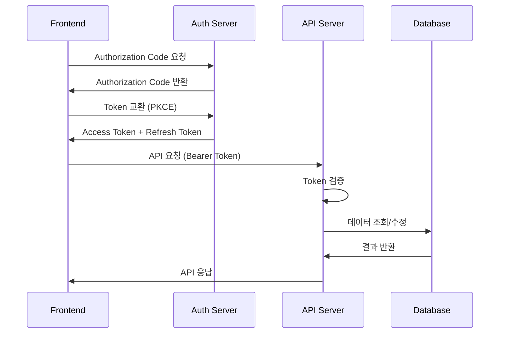
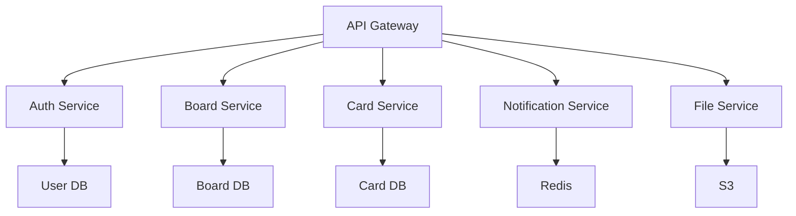

# Boardly Backend

<div align="center">
  <h1>⚡ Boardly Backend</h1>
  <p>Spring Boot 3 + PostgreSQL로 구축된 고성능 칸반 보드 API 서버</p>
  
  [](https://spring.io/projects/spring-boot)
  [](https://openjdk.java.net/projects/jdk/21/)
  [](https://www.postgresql.org/)
  [](https://gradle.org/)
  [](https://www.openapis.org/)
</div>

## 📋 목차

- [프로젝트 개요](#-프로젝트-개요)
- [기술 스택](#-기술-스택)
- [아키텍처](#-아키텍처)
- [프로젝트 구조](#-프로젝트-구조)
- [빠른 시작](#-빠른-시작)
- [환경 설정](#-환경-설정)
- [개발 가이드](#-개발-가이드)
- [API 문서](#-api-문서)
- [데이터베이스](#-데이터베이스)
- [보안](#-보안)
- [테스팅](#-테스팅)
- [배포](#-배포)

## 🎯 프로젝트 개요

Boardly Backend는 Spring Boot 3 기반의 RESTful API 서버로, 칸반 보드 애플리케이션을 위한 강력하고 확장 가능한 백엔드 시스템입니다. Clean Architecture와 DDD(Domain-Driven Design) 원칙을 적용하여 유지보수성과 확장성을 극대화했습니다.

### 주요 특징
- **현대적 기술 스택**: Spring Boot 3.5.3, Java 21
- **Clean Architecture**: 계층 분리 및 의존성 역전 원칙 적용
- **도메인 주도 설계**: 비즈니스 로직의 명확한 분리
- **타입 안전성**: Vavr Either를 활용한 함수형 오류 처리
- **자동 문서화**: OpenAPI 3.0 기반 API 문서 자동 생성
- **확장 가능한 구조**: 기능별 모듈화된 패키지 구조

## 🛠 기술 스택

### Core Technologies
| 기술 | 버전 | 용도 |
|------|------|------|
| **Java** | 21 | 메인 프로그래밍 언어 |
| **Spring Boot** | 3.5.3 | 애플리케이션 프레임워크 |
| **Spring Security** | 6.x | 인증 및 권한 관리 |
| **Spring Data JPA** | 3.x | 데이터 액세스 계층 |
| **Gradle** | 8.x | 빌드 도구 및 의존성 관리 |

### Database
| 기술 | 버전 | 용도 |
|------|------|------|
| **PostgreSQL** | Latest | 메인 데이터베이스 |
| **H2** | 2.3.232 | 테스트 데이터베이스 |

### Security & OAuth
| 기술 | 버전 | 용도 |
|------|------|------|
| **OAuth2 Authorization Server** | Latest | OAuth2 인증 서버 |
| **Spring Security** | 6.5.1 | 보안 프레임워크 |

### Documentation & Testing
| 기술 | 버전 | 용도 |
|------|------|------|
| **SpringDoc OpenAPI** | 2.8.9 | API 문서 자동 생성 |
| **JUnit 5** | Latest | 단위 테스트 프레임워크 |

### Utility Libraries
| 기술 | 버전 | 용도 |
|------|------|------|
| **Lombok** | 1.18.38 | 보일러플레이트 코드 제거 |
| **Vavr** | 0.10.6 | 함수형 프로그래밍 지원 |
| **Apache Commons Lang** | 3.17.0 | 유틸리티 함수 |
| **ULID Creator** | 5.2.3 | 고유 식별자 생성 |
| **Caffeine** | 3.2.2 | 고성능 캐싱 |

## 🏗 아키텍처

### Clean Architecture 레이어



### 계층별 책임
- **Presentation**: HTTP 요청/응답 처리, DTO 변환
- **Application**: 비즈니스 플로우 조율, 트랜잭션 관리
- **Domain**: 핵심 비즈니스 로직, 도메인 규칙
- **Infrastructure**: 외부 시스템 연동, 데이터 저장소

## 📁 프로젝트 구조

```
src/main/java/com/boardly/
├── features/                           # 기능별 모듈
│   ├── auth/                          # 인증 기능
│   │   ├── application/               # 애플리케이션 계층
│   │   │   ├── service/              # 서비스 구현체
│   │   │   ├── usecase/              # 유스케이스 인터페이스
│   │   │   ├── port/                 # 포트 정의
│   │   │   │   ├── input/            # 입력 포트 (Command/Query)
│   │   │   │   └── output/           # 출력 포트
│   │   │   └── dto/                  # 데이터 전송 객체
│   │   ├── domain/                   # 도메인 계층
│   │   │   ├── model/                # 도메인 엔티티
│   │   │   ├── repository/           # 리포지토리 인터페이스
│   │   │   └── service/              # 도메인 서비스
│   │   ├── infrastructure/           # 인프라스트럭처 계층
│   │   │   ├── persistence/          # 데이터 저장소
│   │   │   └── config/               # 설정
│   │   └── presentation/             # 프레젠테이션 계층
│   │       ├── controller/           # REST 컨트롤러
│   │       └── dto/                  # API DTO
│   │
│   ├── user/                         # 사용자 관리
│   ├── board/                        # 보드 관리
│   ├── boardlist/                    # 리스트 관리
│   ├── card/                         # 카드 관리
│   ├── activity/                     # 활동 로그
│   ├── dashboard/                    # 대시보드
│   ├── attachment/                   # 첨부파일 (계획 중)
│   └── label/                        # 라벨 시스템 (계획 중)
│
├── shared/                           # 공통 모듈
│   ├── application/                  # 공통 애플리케이션 로직
│   │   └── validation/               # 검증 로직
│   ├── domain/                       # 공통 도메인 로직
│   │   ├── common/                   # 공통 도메인 객체
│   │   └── event/                    # 도메인 이벤트
│   ├── infrastructure/               # 공통 인프라
│   │   ├── config/                   # 글로벌 설정
│   │   └── persistence/              # 공통 데이터 액세스
│   └── presentation/                 # 공통 프레젠테이션
│       ├── response/                 # 공통 응답 형식
│       └── exception/                # 글로벌 예외 처리
│
└── BoardlyApplication.java           # 메인 애플리케이션 클래스

# 리소스 파일
src/main/resources/
├── application.yml                   # 메인 설정 파일
├── application-dev.yml               # 개발 환경 설정
├── application-prod.yml              # 운영 환경 설정
├── application-test.yml              # 테스트 환경 설정
├── data.sql                         # 초기 데이터
├── schema.sql                       # 데이터베이스 스키마
└── static/                          # 정적 리소스
    └── docs/                        # API 문서

# 설정 파일
├── build.gradle                     # Gradle 빌드 설정
├── gradle/                          # Gradle Wrapper
│   └── libs.versions.toml           # 라이브러리 버전 관리
├── settings.gradle                  # Gradle 프로젝트 설정
├── .gitignore                      # Git 무시 파일
└── README.md                       # 백엔드 문서 (현재 파일)
```

## 🚀 빠른 시작

### 사전 요구사항
- **Java 21** 이상
- **PostgreSQL 12** 이상
- **Docker** (선택사항)

### 1. 저장소 클론 및 환경 설정
```bash
# 저장소 클론
git clone https://github.com/dongwonkwak/boardly.git
cd boardly/backend

# 환경 변수 설정
cp application-dev.yml.example application-dev.yml
vim src/main/resources/application-dev.yml
```

### 2. 데이터베이스 설정

#### PostgreSQL 설치 및 실행
```bash
# Docker를 이용한 PostgreSQL 실행
docker run --name boardly-postgres \
  -e POSTGRES_DB=boardly \
  -e POSTGRES_USER=boardly \
  -e POSTGRES_PASSWORD=password \
  -p 5432:5432 \
  -d postgres:15-alpine

# 데이터베이스 연결 확인
docker exec -it boardly-postgres psql -U boardly -d boardly
```

### 3. 애플리케이션 실행
```bash
# 개발 모드로 실행
./gradlew bootRun --args='--spring.profiles.active=dev'

# 또는 직접 실행
./gradlew build
java -jar build/libs/boardly-backend-0.0.1-SNAPSHOT.jar --spring.profiles.active=dev
```

### 4. 실행 확인
```bash
# Health Check
curl http://localhost:8080/actuator/health

# API 문서 접속
# 브라우저에서: http://localhost:8080/swagger-ui.html
```

## ⚙️ 환경 설정

### application-dev.yml
```yaml
spring:
  application:
    name: boardly-backend
  
  # 데이터베이스 연결
  datasource:
    url: jdbc:postgresql://localhost:5432/boardly
    username: boardly
    password: password
    driver-class-name: org.postgresql.Driver
  
  # JPA 설정
  jpa:
    hibernate:
      ddl-auto: update
    show-sql: true
    properties:
      hibernate:
        format_sql: true
        dialect: org.hibernate.dialect.PostgreSQLDialect
  
  # OAuth2 설정
  security:
    oauth2:
      authorization-server:
        client:
          boardly-client:
            registration:
              client-id: boardly-client
              client-secret: {noop}secret
              authorization-grant-types:
                - authorization_code
                - refresh_token
              redirect-uris:
                - http://localhost:3000/callback
              scopes:
                - read
                - write

# 로깅 설정
logging:
  level:
    com.boardly: DEBUG
    org.springframework.security: DEBUG
    org.hibernate.SQL: DEBUG

# OpenAPI 문서 설정
springdoc:
  swagger-ui:
    path: /swagger-ui.html
  api-docs:
    path: /api-docs

# 애플리케이션 설정
boardly:
  cors:
    allowed-origins:
      - http://localhost:3000
      - http://localhost:5173
  attachment:
    policy:
      max-file-size-mb: 10
      max-attachments-per-card: 5
      max-file-name-length: 255
```

### application-prod.yml
```yaml
spring:
  datasource:
    url: ${DATABASE_URL}
    username: ${DATABASE_USERNAME}
    password: ${DATABASE_PASSWORD}
  
  jpa:
    hibernate:
      ddl-auto: validate
    show-sql: false
  
  security:
    oauth2:
      authorization-server:
        client:
          boardly-client:
            registration:
              client-id: ${OAUTH_CLIENT_ID}
              client-secret: ${OAUTH_CLIENT_SECRET}
              redirect-uris:
                - ${FRONTEND_URL}/callback

logging:
  level:
    com.boardly: INFO
    org.springframework.security: WARN
```

## 💻 개발 가이드

### 사용 가능한 Gradle 태스크

```bash
# 개발 서버 실행
./gradlew bootRun

# 빌드
./gradlew build                    # 전체 빌드
./gradlew assemble                # 컴파일만 (테스트 제외)

# 테스트
./gradlew test                    # 단위 테스트
./gradlew integrationTest         # 통합 테스트

# 코드 품질
./gradlew check                   # 모든 검증 실행
./gradlew spotlessCheck          # 코드 포맷 검사
./gradlew spotlessApply          # 코드 포맷 적용

# 문서화
./gradlew generateOpenApiDocs     # OpenAPI 문서 생성
./gradlew copyOpenApiToStatic     # Static 리소스로 복사
./gradlew copyOpenApiToProjectRoot # 프로젝트 루트로 복사

# 정리
./gradlew clean                   # 빌드 파일 정리
```

### 코딩 컨벤션

#### 1. 패키지 구조 규칙
```java
// ✅ 좋은 예 - 기능별 계층 구조
com.boardly.features.board.application.service.CreateBoardService
com.boardly.features.board.domain.model.Board
com.boardly.features.board.infrastructure.persistence.BoardEntity

// ❌ 피해야 할 예 - 계층별 패키지 구조
com.boardly.service.board.CreateBoardService
com.boardly.entity.BoardEntity
```

#### 2. UseCase 인터페이스 정의
```java
// ✅ 좋은 예
public interface CreateBoardUseCase {
    Either<Failure, Board> execute(CreateBoardCommand command);
}

@Service
public class CreateBoardService implements CreateBoardUseCase {
    @Override
    @Transactional
    public Either<Failure, Board> execute(CreateBoardCommand command) {
        // 구현
    }
}
```

#### 3. 에러 처리 패턴
```java
// ✅ Vavr Either를 활용한 함수형 에러 처리
public Either<Failure, Board> createBoard(CreateBoardCommand command) {
    return validateCommand(command)
        .flatMap(this::checkBoardLimit)
        .flatMap(this::createDomainEntity)
        .flatMap(boardRepository::save)
        .peek(this::publishEvent);
}

// ❌ 예외 기반 처리는 최소화
public Board createBoard(CreateBoardCommand command) throws BusinessException {
    // 피해야 할 패턴
}
```

#### 4. 도메인 모델 및 검증 설계
```java
// ✅ 좋은 예 - 불변성과 캡슐화
public class Board extends BaseEntity {
    private final BoardId boardId;
    private final UserId ownerId;
    private String title;
    private String description;
    
    
    public void updateTitle(String newTitle) {
        this.title = newTitle.trim();
        markAsUpdated();
    }
}

// ✅ 도메인별 검증 로직 분리
@Component
public class BoardValidator {
    
    private final CommonValidationRules commonValidationRules;
    
    public ValidationResult<CreateBoardCommand> validateCreate(CreateBoardCommand command) {
        return Validator.combine(
            // 제목 검증: 필수, 1-100자, HTML 태그 금지
            commonValidationRules.titleComplete(CreateBoardCommand::title),
            // 설명 검증: 선택사항, 500자까지, HTML 태그 금지
            commonValidationRules.descriptionComplete(CreateBoardCommand::description),
            // 사용자 ID 검증: 필수
            commonValidationRules.userIdRequired(CreateBoardCommand::ownerId)
        ).validate(command);
    }
}

// ✅ 재사용 가능한 공통 검증 규칙
@Component
public class CommonValidationRules {
    
    public <T> Validator<T> titleComplete(Function<T, String> titleExtractor) {
        return Validator.chain(
            required(titleExtractor, "title", messageResolver),
            minLength(titleExtractor, "title", 1, messageResolver),
            maxLength(titleExtractor, "title", 100, messageResolver),
            noHtmlTags(titleExtractor, "title", messageResolver)
        );
    }
}
```

### 검증 아키텍처

#### 계층별 검증 책임


#### 검증 계층 구조
- **Controller**: Bean Validation으로 기본 형식 검증
- **Application**: Validator 클래스로 비즈니스 규칙 검증
- **Domain**: 도메인 모델 내부의 불변식 검증

### 도메인별 Validator 클래스

#### BoardValidator
```java
@Component
public class BoardValidator {
    
    // 보드 생성 검증
    public ValidationResult<CreateBoardCommand> validateCreate(CreateBoardCommand command) {
        return Validator.combine(
            commonValidationRules.titleComplete(CreateBoardCommand::title),
            commonValidationRules.descriptionComplete(CreateBoardCommand::description),
            commonValidationRules.userIdRequired(CreateBoardCommand::ownerId)
        ).validate(command);
    }
    
    // 보드 수정 검증
    public ValidationResult<UpdateBoardCommand> validateUpdate(UpdateBoardCommand command) {
        return Validator.combine(
            commonValidationRules.boardIdRequired(UpdateBoardCommand::boardId),
            commonValidationRules.titleOptional(UpdateBoardCommand::title),
            commonValidationRules.descriptionComplete(UpdateBoardCommand::description)
        ).validate(command);
    }
}
```

#### CardValidator
```java
@Component 
public class CardValidator {
    
    // 카드 생성 검증
    public ValidationResult<CreateCardCommand> validateCreate(CreateCardCommand command) {
        return Validator.combine(
            // 제목: 필수, 1-200자, HTML 태그 금지
            commonValidationRules.cardTitleComplete(CreateCardCommand::title),
            // 설명: 선택사항, 2000자까지, HTML 태그 금지  
            commonValidationRules.cardDescriptionComplete(CreateCardCommand::description),
            // 리스트 ID: 필수
            commonValidationRules.listIdRequired(CreateCardCommand::listId)
        ).validate(command);
    }
    
    // 카드 이동 검증
    public ValidationResult<MoveCardCommand> validateMove(MoveCardCommand command) {
        return Validator.combine(
            commonValidationRules.cardIdRequired(MoveCardCommand::cardId),
            positionValidator(), // 0 이상의 정수
            commonValidationRules.userIdRequired(MoveCardCommand::userId)
        ).validate(command);
    }
}
```

#### CommonValidationRules
```java
@Component
public class CommonValidationRules {
    
    // 보드 제목 완전 검증 (1-100자, HTML 태그 금지)
    public <T> Validator<T> titleComplete(Function<T, String> titleExtractor) {
        return Validator.chain(
            required(titleExtractor, "title", messageResolver),
            minLength(titleExtractor, "title", 1, messageResolver),
            maxLength(titleExtractor, "title", 100, messageResolver),
            noHtmlTags(titleExtractor, "title", messageResolver)
        );
    }
    
    // 카드 제목 완전 검증 (1-200자, HTML 태그 금지)
    public <T> Validator<T> cardTitleComplete(Function<T, String> titleExtractor) {
        return Validator.chain(
            required(titleExtractor, "title", messageResolver),
            minLength(titleExtractor, "title", 1, messageResolver),
            maxLength(titleExtractor, "title", 200, messageResolver),
            noHtmlTags(titleExtractor, "title", messageResolver)
        );
    }
    
    // 설명 완전 검증 (선택사항, HTML 태그 금지)
    public <T> Validator<T> descriptionComplete(Function<T, String> descriptionExtractor) {
        return Validator.chain(
            maxLength(descriptionExtractor, "description", 500, messageResolver),
            noHtmlTags(descriptionExtractor, "description", messageResolver)
        );
    }
}
```
```java
// ✅ 좋은 예
@RestController
@RequestMapping("/api/boards")
@RequiredArgsConstructor
public class BoardController {
    
    private final CreateBoardUseCase createBoardUseCase;
    
    @PostMapping
    public ResponseEntity<?> createBoard(
        @Valid @RequestBody CreateBoardRequest request,
        @AuthenticationPrincipal Jwt jwt) {
        
        return createBoardUseCase
            .execute(CreateBoardCommand.from(request, jwt))
            .fold(
                failure -> ResponseEntity.badRequest().body(ErrorResponse.from(failure)),
                board -> ResponseEntity.ok(BoardResponse.from(board))
            );
    }
}
```

## 📚 API 문서

### OpenAPI 3.0 문서
- **개발 환경**: http://localhost:8080/swagger-ui.html
- **API JSON**: http://localhost:8080/api-docs
- **정적 문서**: `src/main/resources/static/docs/openapi.json`

### 주요 API 엔드포인트

#### 인증 관련
```
POST   /oauth2/authorize                # OAuth2 로그인 시작
POST   /oauth2/token                    # 토큰 교환
POST   /oauth2/token                    # 토큰 갱신
POST   /logout                          # 로그아웃
```

#### 사용자 관리
```
GET    /api/users/profile               # 프로필 조회
PUT    /api/users/profile               # 프로필 수정
PUT    /api/users/password              # 비밀번호 변경
DELETE /api/users/account               # 계정 삭제
```

#### 보드 관리
```
GET    /api/boards                      # 보드 목록 조회
POST   /api/boards                      # 보드 생성
GET    /api/boards/{id}                 # 보드 상세 조회
PUT    /api/boards/{id}                 # 보드 수정
DELETE /api/boards/{id}                 # 보드 삭제
POST   /api/boards/{id}/duplicate       # 보드 복제
```

#### 리스트 관리
```
GET    /api/boards/{boardId}/lists      # 리스트 목록 조회
POST   /api/boards/{boardId}/lists      # 리스트 생성
PUT    /api/lists/{id}                  # 리스트 수정
DELETE /api/lists/{id}                  # 리스트 삭제
PUT    /api/lists/{id}/position         # 리스트 순서 변경
```

#### 카드 관리
```
GET    /api/lists/{listId}/cards        # 카드 목록 조회
POST   /api/lists/{listId}/cards        # 카드 생성
GET    /api/cards/{id}                  # 카드 상세 조회
PUT    /api/cards/{id}                  # 카드 수정
DELETE /api/cards/{id}                  # 카드 삭제
POST   /api/cards/{id}/duplicate        # 카드 복제
PUT    /api/cards/{id}/move             # 카드 이동
```

#### 대시보드
```
GET    /api/dashboard                   # 대시보드 데이터 조회
GET    /api/activities                  # 최근 활동 조회
```

## 🗄 데이터베이스

### ERD (Entity Relationship Diagram)


### 데이터베이스 초기화
```bash
# 스키마 생성 (자동)
./gradlew bootRun  # hibernate.ddl-auto=update

# 초기 데이터 로드
# data.sql 파일이 자동으로 실행됩니다.
```

### 테스트 데이터
개발 환경에서는 `data.sql`을 통해 테스트 데이터가 자동으로 로드됩니다:
- 테스트 사용자: `test@example.com`
- 비밀 번호: `Password1!`
- 샘플 카드 및 활동 로그

## 🔒 보안

### OAuth2 인증 플로우


### 보안 설정
```java
// CORS 설정
@Configuration
public class CorsConfig {
    @Bean
    public CorsConfigurationSource corsConfigurationSource() {
        CorsConfiguration configuration = new CorsConfiguration();
        configuration.setAllowedOrigins(Arrays.asList(
            "http://localhost:3000",
            "http://localhost:5173"
        ));
        configuration.setAllowedMethods(Arrays.asList("*"));
        configuration.setAllowedHeaders(Arrays.asList("*"));
        configuration.setAllowCredentials(true);
        return source;
    }
}
```

### 권한 관리
- **OWNER**: 보드의 모든 권한
- **MEMBER**: 보드 읽기/쓰기 권한
- **VIEWER**: 보드 읽기 전용 권한 (미구현)

## 🧪 테스팅

### 테스트 환경 설정
```yaml
# application-test.yml
spring:
  datasource:
    url: jdbc:h2:mem:testdb
    driver-class-name: org.h2.Driver
  jpa:
    hibernate:
      ddl-auto: create-drop
  sql:
    init:
      mode: never
```

### 테스트 실행
```bash
# 전체 테스트
./gradlew test

# 특정 테스트 클래스
./gradlew test --tests "CreateBoardServiceTest"

# 통합 테스트
./gradlew integrationTest

# 테스트 커버리지
./gradlew jacocoTestReport
```

### 테스트 작성 예시
```java
@SpringBootTest
@Transactional
class CreateBoardServiceTest {

    @Autowired
    private CreateBoardService createBoardService;

    @Test
    @DisplayName("유효한 보드 생성 명령으로 보드를 성공적으로 생성한다")
    void createBoard_WithValidCommand_ShouldReturnSuccess() {
        // Given
        CreateBoardCommand command = CreateBoardCommand.builder()
            .title("테스트 보드")
            .description("테스트 설명")
            .ownerId(new UserId("user_test"))
            .build();

        // When
        Either<Failure, Board> result = createBoardService.execute(command);

        // Then
        assertThat(result.isRight()).isTrue();
        assertThat(result.get().getTitle()).isEqualTo("테스트 보드");
    }
}
```

## 🚀 배포

### Docker 이미지 빌드
```bash
# Dockerfile을 이용한 이미지 빌드
docker build -t boardly-backend .

# 멀티 스테이지 빌드로 최적화
docker build -t boardly-backend:latest -f Dockerfile.prod .
```

### Docker Compose 배포
```yaml
# docker-compose.prod.yml
version: '3.8'
services:
  app:
    image: boardly-backend:latest
    ports:
      - "8080:8080"
    environment:
      - SPRING_PROFILES_ACTIVE=prod
      - DATABASE_URL=jdbc:postgresql://db:5432/boardly
      - DATABASE_USERNAME=boardly
      - DATABASE_PASSWORD=${DB_PASSWORD}
    depends_on:
      - db
      
  db:
    image: postgres:15-alpine
    environment:
      - POSTGRES_DB=boardly
      - POSTGRES_USER=boardly
      - POSTGRES_PASSWORD=${DB_PASSWORD}
    volumes:
      - postgres_data:/var/lib/postgresql/data

volumes:
  postgres_data:
```

### 환경별 배포 전략

#### 개발 환경
```bash
# 로컬 개발
./gradlew bootRun --args='--spring.profiles.active=dev'

# Docker 개발 환경
docker-compose -f docker-compose.dev.yml up
```

#### 스테이징 환경
```bash
# 스테이징 배포
docker-compose -f docker-compose.staging.yml up -d

# 헬스 체크
curl http://staging-api.boardly.com/actuator/health
```

#### 프로덕션 환경
```bash
# 프로덕션 배포
docker-compose -f docker-compose.prod.yml up -d

# 로그 확인
docker-compose logs -f app

# 헬스 체크
curl https://api.boardly.com/actuator/health
```


## 📊 모니터링 및 로깅

### Actuator 엔드포인트
```yaml
# application.yml
management:
  endpoints:
    web:
      exposure:
        include: health,info,metrics,prometheus
  endpoint:
    health:
      show-details: always
  metrics:
    export:
      prometheus:
        enabled: true
```

### 주요 모니터링 메트릭
```bash
# 애플리케이션 상태
curl http://localhost:8080/actuator/health

# 메트릭 정보
curl http://localhost:8080/actuator/metrics

# 프로메테우스 메트릭
curl http://localhost:8080/actuator/prometheus
```

### 로깅 설정
```yaml
# logback-spring.xml 설정
logging:
  level:
    com.boardly: INFO
    org.springframework.security: WARN
    org.hibernate.SQL: WARN
  pattern:
    console: "%d{yyyy-MM-dd HH:mm:ss} - %msg%n"
    file: "%d{yyyy-MM-dd HH:mm:ss} [%thread] %-5level %logger{36} - %msg%n"
  file:
    name: logs/boardly-backend.log
```

## 🔧 성능 최적화

### 데이터베이스 최적화
```sql
-- 주요 인덱스 설정
CREATE INDEX CONCURRENTLY idx_boards_owner_id ON boards(owner_id);
CREATE INDEX CONCURRENTLY idx_board_lists_board_id ON board_lists(board_id);
CREATE INDEX CONCURRENTLY idx_cards_list_id ON cards(list_id);
CREATE INDEX CONCURRENTLY idx_user_activity_board_id ON user_activity(board_id);
CREATE INDEX CONCURRENTLY idx_user_activity_created_at ON user_activity(created_at DESC);

-- 복합 인덱스
CREATE INDEX CONCURRENTLY idx_cards_list_position ON cards(list_id, position);
CREATE INDEX CONCURRENTLY idx_board_lists_board_position ON board_lists(board_id, position);
```

### 캐싱 전략
```java
@Configuration
@EnableCaching
public class CacheConfig {

    @Bean
    public CacheManager cacheManager() {
        CaffeineCacheManager cacheManager = new CaffeineCacheManager();
        cacheManager.setCaffeine(Caffeine.newBuilder()
            .maximumSize(1000)
            .expireAfterWrite(10, TimeUnit.MINUTES)
            .recordStats());
        return cacheManager;
    }
}

// 서비스에서 캐시 활용
@Service
public class BoardService {
    
    @Cacheable(value = "boards", key = "#boardId")
    public Optional<Board> findById(BoardId boardId) {
        return boardRepository.findById(boardId);
    }
}
```


## 📈 확장 계획

### 마이크로서비스 분리 계획


### 향후 기능 로드맵
1. **Phase 1 (현재)**: 기본 칸반 보드 기능
2. **Phase 2**: 실시간 협업, 알림 시스템
3. **Phase 3**: 파일 첨부, 라벨 시스템
4. **Phase 4**: 고급 권한 관리, 워크스페이스
5. **Phase 5**: 마이크로서비스 분리, 확장성 개선


---

<div align="center">
  <p>Made with ❤️ by the Boardly Team</p>
  <p>Spring Boot 3 + Clean Architecture로 구축된 현대적 백엔드</p>
  
  ### 문의 및 지원
  - **GitHub Issues**: 버그 리포트 및 기능 요청
  - **API 문서**: [link](../docs/api/openapi.json)
  - **이메일**: dongwon.kwak@gmail.com
</div>