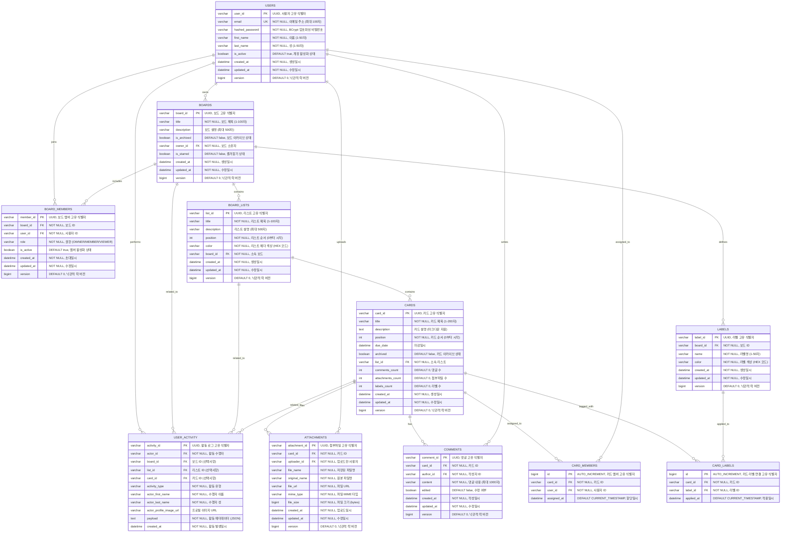

# Boardly Project - ERD (Entity Relationship Diagram)



## 데이터베이스 제약 조건

### 1. 사용자 제약 조건
- **이메일**: 유효한 이메일 형식, 중복 불가 (UNIQUE)
- **비밀번호**: BCrypt 암호화 필수
- **이름/성**: 1-50자, 필수
- **활성화 상태**: 기본값 true

### 2. 보드 제약 조건
- **보드 제목**: 1-100자, 필수
- **보드 설명**: 최대 500자
- **소유자**: 필수 (users 테이블 참조)
- **아카이브 상태**: 기본값 false
- **즐겨찾기**: 기본값 false

### 3. 보드 멤버 제약 조건
- **보드-사용자 조합**: 중복 불가 (UNIQUE)
- **권한**: OWNER/MEMBER/VIEWER 중 하나
- **활성화 상태**: 기본값 true

### 4. 리스트 제약 조건
- **리스트 제목**: 1-100자, 필수
- **리스트 설명**: 최대 500자
- **순서**: 0부터 시작하는 정수, 필수
- **색상**: HEX 코드 형식, 필수
- **보드**: 필수 (boards 테이블 참조)

### 5. 카드 제약 조건
- **카드 제목**: 1-200자, 필수
- **카드 설명**: 마크다운 지원
- **순서**: 0부터 시작하는 정수, 필수
- **마감일**: 선택사항
- **아카이브 상태**: 기본값 false
- **리스트**: 필수 (board_lists 테이블 참조)
- **카운터 필드**: comments_count, attachments_count, labels_count

### 6. 카드 멤버 제약 조건
- **카드-사용자 조합**: 중복 불가 (UNIQUE)
- **할당일시**: 기본값 CURRENT_TIMESTAMP

### 7. 라벨 제약 조건
- **라벨명**: 1-50자, 필수
- **색상**: HEX 코드 형식, 필수
- **보드-라벨명 조합**: 중복 불가 (UNIQUE)

### 8. 카드 라벨 연결 제약 조건
- **카드-라벨 조합**: 중복 불가 (UNIQUE)
- **적용일시**: 기본값 CURRENT_TIMESTAMP

### 9. 댓글 제약 조건
- **댓글 내용**: 최대 1000자, 필수
- **수정 여부**: 기본값 false
- **작성자**: 필수 (users 테이블 참조)

### 10. 첨부파일 제약 조건
- **파일명**: 필수
- **원본 파일명**: 필수
- **파일 URL**: 필수
- **MIME 타입**: 필수
- **파일 크기**: 필수
- **업로드자**: 필수 (users 테이블 참조)

### 11. 사용자 활동 제약 조건
- **활동 수행자**: 필수 (users 테이블 참조)
- **활동 유형**: 필수
- **페이로드**: JSON 형식, 필수
- **관련 엔티티**: board_id, list_id, card_id 중 하나 이상

## 인덱스 최적화

### 성능 최적화를 위한 인덱스
```sql
-- 보드 관련 인덱스
CREATE INDEX idx_boards_owner_id ON boards(owner_id);
CREATE INDEX idx_boards_archived ON boards(is_archived);
CREATE INDEX idx_boards_starred ON boards(is_starred);

-- 보드 멤버 관련 인덱스
CREATE INDEX idx_board_members_board_id ON board_members(board_id);
CREATE INDEX idx_board_members_user_id ON board_members(user_id);
CREATE INDEX idx_board_members_active ON board_members(is_active);

-- 보드 리스트 관련 인덱스
CREATE INDEX idx_board_lists_board_id ON board_lists(board_id);
CREATE INDEX idx_board_lists_position ON board_lists(board_id, position);

-- 카드 관련 인덱스
CREATE INDEX idx_cards_list_id ON cards(list_id);
CREATE INDEX idx_cards_position ON cards(list_id, position);
CREATE INDEX idx_cards_due_date ON cards(due_date);
CREATE INDEX idx_cards_archived ON cards(archived);

-- 카드 멤버 관련 인덱스
CREATE INDEX idx_card_members_card_id ON card_members(card_id);
CREATE INDEX idx_card_members_user_id ON card_members(user_id);

-- 라벨 관련 인덱스
CREATE INDEX idx_labels_board_id ON labels(board_id);
CREATE INDEX idx_labels_name ON labels(board_id, name);

-- 카드 라벨 관련 인덱스
CREATE INDEX idx_card_labels_card_id ON card_labels(card_id);
CREATE INDEX idx_card_labels_label_id ON card_labels(label_id);

-- 댓글 관련 인덱스
CREATE INDEX idx_comments_card_id ON comments(card_id);
CREATE INDEX idx_comments_author_id ON comments(author_id);
CREATE INDEX idx_comments_created_at ON comments(created_at);

-- 첨부파일 관련 인덱스
CREATE INDEX idx_attachments_card_id ON attachments(card_id);
CREATE INDEX idx_attachments_uploader_id ON attachments(uploader_id);
CREATE INDEX idx_attachments_created_at ON attachments(created_at);

-- 사용자 활동 관련 인덱스
CREATE INDEX idx_activity_board_id ON user_activity(board_id);
CREATE INDEX idx_activity_actor_id ON user_activity(actor_id);
CREATE INDEX idx_activity_created_at ON user_activity(created_at);
CREATE INDEX idx_activity_board_timestamp ON user_activity(board_id, created_at);
CREATE INDEX idx_activity_type ON user_activity(activity_type);
```

## 데이터 무결성 규칙

### 1. CASCADE 삭제 규칙
- 사용자 삭제 시 → 소유한 모든 보드, 활동 로그 삭제
- 보드 삭제 시 → 포함된 모든 리스트, 라벨, 멤버, 활동 로그 삭제
- 리스트 삭제 시 → 포함된 모든 카드, 활동 로그 삭제
- 카드 삭제 시 → 관련 댓글, 첨부파일, 라벨 연결, 멤버 할당, 활동 로그 삭제

### 2. 외래키 제약 조건
- 모든 FK는 참조 무결성 보장
- 순환 참조 방지
- NOT NULL 제약 조건 적용

### 3. 낙관적 락 (Optimistic Locking)
- 모든 엔티티에 version 필드 추가
- 동시 수정 충돌 방지
- 버전 불일치 시 예외 발생

### 4. 데이터 검증
- 입력 데이터 길이 및 형식 검증
- 비즈니스 로직 검증
- 중복 데이터 방지 (UNIQUE 제약 조건)

---

**문서 버전**: v2.0  
**최종 수정일**: 2025년 1월 17일  
**기반 스키마**: schema.sql