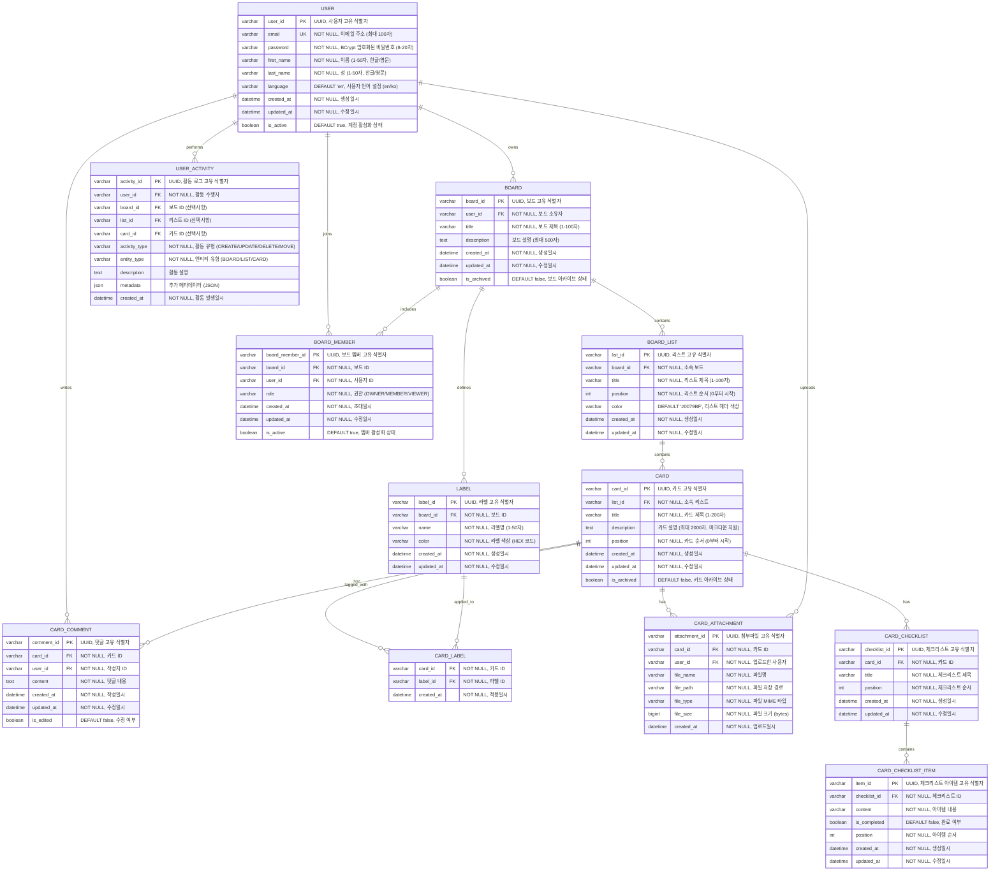

# Boardly Project - ERD (Entity Relationship Diagram)



## 데이터베이스 제약 조건

### 1. 사용자 제약 조건
- **이메일**: 유효한 이메일 형식, 중복 불가
- **비밀번호**: 8-20자, 영문+숫자+특수문자 포함
- **이름/성**: 1-50자, 한글/영문만 허용

### 2. 보드 제약 조건
- **사용자당 보드 수**: 최대 50개
- **보드 제목**: 1-100자, 필수
- **보드 설명**: 최대 500자

### 3. 리스트 제약 조건
- **보드당 리스트 수**: 최대 20개
- **리스트 제목**: 1-100자, 필수
- **리스트 순서**: 0부터 시작하는 정수

### 4. 카드 제약 조건
- **리스트당 카드 수**: 최대 100개
- **카드 제목**: 1-200자, 필수
- **카드 설명**: 최대 2000자, 마크다운 지원
- **카드 순서**: 0부터 시작하는 정수

### 5. 인덱스 최적화
```sql
-- 성능 최적화를 위한 인덱스
CREATE INDEX idx_board_user_id ON BOARD(user_id);
CREATE INDEX idx_board_list_board_id ON BOARD_LIST(board_id);
CREATE INDEX idx_board_list_position ON BOARD_LIST(board_id, position);
CREATE INDEX idx_card_list_id ON CARD(list_id);
CREATE INDEX idx_card_position ON CARD(list_id, position);
CREATE INDEX idx_user_activity_user_id ON USER_ACTIVITY(user_id);
CREATE INDEX idx_user_activity_created_at ON USER_ACTIVITY(created_at);
```

## 데이터 무결성 규칙

### 1. CASCADE 삭제 규칙
- 사용자 삭제 시 → 소유한 모든 보드 삭제
- 보드 삭제 시 → 포함된 모든 리스트 삭제
- 리스트 삭제 시 → 포함된 모든 카드 삭제
- 카드 삭제 시 → 관련 댓글, 첨부파일, 라벨 연결 삭제

### 2. 외래키 제약 조건
- 모든 FK는 NOT NULL (필수 관계)
- 참조 무결성 보장
- 순환 참조 방지

### 3. 데이터 검증
- 입력 데이터 길이 및 형식 검증
- 비즈니스 로직 검증 (제한 개수 등)
- 중복 데이터 방지

---

**문서 버전**: v1.1  
**최종 수정일**: 2025년 1월 17일  
**작성자**: Boardly 개발팀