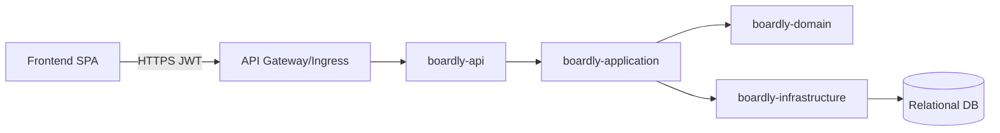

# 아키텍처 개요

포트폴리오 리뷰어를 위한 Boardly의 목표 아키텍처 요약입니다.

## 컨텍스트(C4 L1)
- 사용자는 워크스페이스 안에서 보드로 협업합니다.
- 시스템은 프론트엔드에 REST API를 제공합니다. 인증은 JWT를 사용합니다.
- 영속성 계층은 RDB + Flyway 마이그레이션을 사용하며, 멀티테넌시는 `Workspace` 키로 모델링합니다.

## 컨테이너(C4 L2)
- 프론트엔드(SPA)
- 백엔드(Spring Boot 멀티 모듈)
  - `boardly-api`: API 계약, i18n 메시지 번들
  - `boardly-application`: 유스케이스, 오케스트레이션
  - `boardly-domain`: 엔티티/값 객체(예: `WorkspaceId`, `WorkspaceInvitationId`)
  - `boardly-infrastructure`: JPA, Security, Flyway, 설정(`SecurityConfig`, `JwtConfig`)
  - `boardly-shared`: 공용 프리미티브(예: `Path`)
- 데이터베이스: PostgreSQL(가정), Flyway로 스키마 버저닝(`V2__workspace_multi_tenant.sql`, `V3__migrate_workspace_initial_data.sql`)

## 하이레벨 컴포넌트 다이어그램(Mermaid)

## 횡단 관심사
- 인증/인가: Spring Security + JWT(Stateless). RBAC은 Workspace/Board/Card 범위로 스코프.
- i18n: `messages/*.properties` 메시지 번들 사용.
- 마이그레이션: 환경별 시드 스크립트 포함 `db/migration/*`.
- 관찰 가능성: 구조화 로깅, 추후 요청 필터로 Trace ID 주입 예정.

## 관련 문서
- [권한 시스템](./permissions/) - 워크스페이스 및 보드 권한 정의
- [ADR](./adr/) - 아키텍처 결정 기록

## 주요 설계 결정(자세한 내용은 ADR 참조)
- 세션 관리를 위한 JWT 채택
- 워크스페이스 스코프 멀티테넌시
- 에러 응답 표준화 + i18n

## 비기능 목표
- 개발 생산성: 모듈 경계 명확화, 테스트 용이성
- 성능: 리스트/카드 조작 효율성, 전 API 페이징
- 보안: 입력 검증, CORS, 속도 제한(계획)
