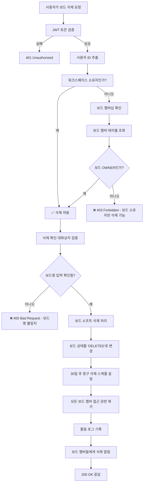

# 보드 삭제 권한 검증 플로우



## 보드 삭제 검증 코드

```javascript
async function deleteBoardWithPermissionCheck(userId, boardId, confirmationData) {
  // 1. 권한 검증
  const board = await boardRepository.findById(boardId);
  if (!board) {
    throw new NotFoundException('보드를 찾을 수 없습니다');
  }
  
  // 2. 워크스페이스 소유자 또는 보드 소유자만 삭제 가능
  const workspace = await workspaceRepository.findById(board.workspaceId);
  const boardMember = await boardMemberRepository.findByUserAndBoard(userId, boardId);
  
  const isWorkspaceOwner = workspace.ownerId === userId;
  const isBoardOwner = boardMember?.role === 'OWNER';
  
  if (!isWorkspaceOwner && !isBoardOwner) {
    throw new ForbiddenException('보드를 삭제할 권한이 없습니다. 보드 소유자만 삭제할 수 있습니다');
  }
  
  // 3. 삭제 확인 검증
  if (confirmationData.boardName !== board.name) {
    throw new BadRequestException('보드명이 일치하지 않습니다');
  }
  
  // 4. 소프트 삭제 처리
  return await boardDeletionService.softDelete(boardId, userId);
}
```