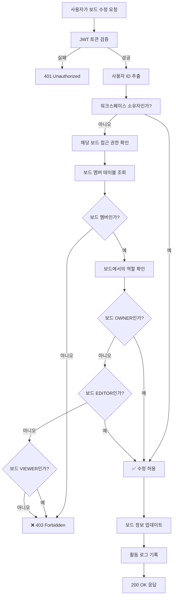

# 보드 수정 권한 검증 플로우



## 권한 검증 코드 예시

```javascript
async function checkBoardEditPermission(userId, boardId) {
  // 1. 보드 정보 조회
  const board = await boardRepository.findById(boardId);
  if (!board) {
    throw new NotFoundException('보드를 찾을 수 없습니다');
  }
  
  // 2. 워크스페이스 소유자 확인 (최고 권한)
  const workspace = await workspaceRepository.findById(board.workspaceId);
  if (workspace.ownerId === userId) {
    return { allowed: true, reason: 'workspace_owner' };
  }
  
  // 3. 보드 멤버십 확인
  const boardMember = await boardMemberRepository.findByUserAndBoard(userId, boardId);
  if (!boardMember) {
    throw new ForbiddenException('보드에 접근할 권한이 없습니다');
  }
  
  // 4. 보드 역할 확인
  if (boardMember.role === 'OWNER' || boardMember.role === 'EDITOR') {
    return { allowed: true, reason: `board_${boardMember.role.toLowerCase()}` };
  }
  
  throw new ForbiddenException('보드를 수정할 권한이 없습니다');
}
```