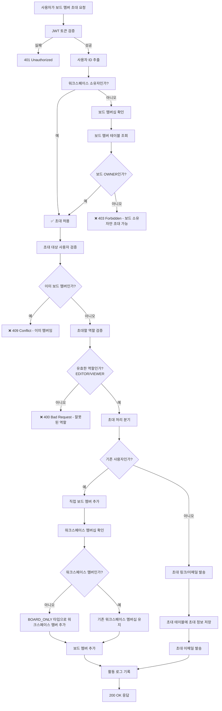

# 보드 멤버 초대 권한 검증 플로우



## 보드 멤버 초대 검증 코드

```javascript
async function inviteBoardMemberWithPermissionCheck(inviterId, boardId, inviteData) {
  // 1. 초대자 권한 검증
  const board = await boardRepository.findById(boardId);
  if (!board) {
    throw new NotFoundException('보드를 찾을 수 없습니다');
  }
  
  const workspace = await workspaceRepository.findById(board.workspaceId);
  const boardMember = await boardMemberRepository.findByUserAndBoard(inviterId, boardId);
  
  const isWorkspaceOwner = workspace.ownerId === inviterId;
  const isBoardOwner = boardMember?.role === 'OWNER';
  
  if (!isWorkspaceOwner && !isBoardOwner) {
    throw new ForbiddenException('보드에 멤버를 초대할 권한이 없습니다');
  }
  
  // 2. 초대 대상 검증
  const targetUser = await userRepository.findByEmail(inviteData.email);
  
  if (targetUser) {
    // 기존 사용자인 경우
    const existingBoardMember = await boardMemberRepository.findByUserAndBoard(targetUser.id, boardId);
    if (existingBoardMember) {
      throw new ConflictException('이미 보드의 멤버입니다');
    }
    
    // 직접 멤버 추가
    return await addBoardMemberDirectly(targetUser.id, boardId, inviteData.role, inviterId);
  } else {
    // 신규 사용자인 경우 - 초대 링크/이메일 발송
    return await createBoardInvitation(inviteData.email, boardId, inviteData.role, inviterId);
  }
}

async function addBoardMemberDirectly(userId, boardId, role, invitedBy) {
  // 워크스페이스 멤버십 확인 및 설정
  const board = await boardRepository.findById(boardId);
  const workspaceMember = await workspaceMemberRepository.findByUserAndWorkspace(userId, board.workspaceId);
  
  if (!workspaceMember) {
    // BOARD_ONLY 타입으로 워크스페이스 멤버 추가
    await workspaceMemberRepository.create({
      userId,
      workspaceId: board.workspaceId,
      role: 'MEMBER',
      type: 'BOARD_ONLY',
      invitedBy,
      joinedAt: new Date()
    });
  }
  
  // 보드 멤버 추가
  await boardMemberRepository.create({
    userId,
    boardId,
    role,
    invitedBy,
    invitationType: 'INDIVIDUAL',
    joinedAt: new Date()
  });
  
  // 활동 로그 기록
  await activityRepository.create({
    type: 'BOARD_ADD_MEMBER',
    userId: invitedBy,
    boardId,
    payload: {
      memberId: userId,
      memberRole: role
    }
  });
}
```