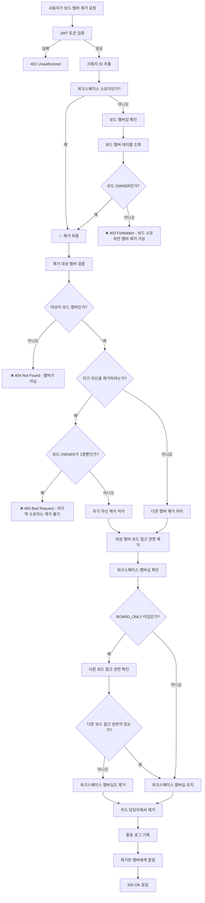

# 보드 멤버 제거 권한 검증 플로우



## 보드 멤버 제거 검증 코드

```javascript
async function removeBoardMemberWithPermissionCheck(removerId, boardId, targetUserId) {
  // 1. 제거자 권한 검증
  const board = await boardRepository.findById(boardId);
  if (!board) {
    throw new NotFoundException('보드를 찾을 수 없습니다');
  }
  
  const workspace = await workspaceRepository.findById(board.workspaceId);
  const removerBoardMember = await boardMemberRepository.findByUserAndBoard(removerId, boardId);
  
  const isWorkspaceOwner = workspace.ownerId === removerId;
  const isBoardOwner = removerBoardMember?.role === 'OWNER';
  
  if (!isWorkspaceOwner && !isBoardOwner) {
    throw new ForbiddenException('보드 멤버를 제거할 권한이 없습니다');
  }
  
  // 2. 제거 대상 검증
  const targetBoardMember = await boardMemberRepository.findByUserAndBoard(targetUserId, boardId);
  if (!targetBoardMember) {
    throw new NotFoundException('해당 사용자는 보드 멤버가 아닙니다');
  }
  
  // 3. 자기 자신 제거 시 추가 검증
  if (removerId === targetUserId) {
    const boardOwnerCount = await boardMemberRepository.countOwners(boardId);
    if (targetBoardMember.role === 'OWNER' && boardOwnerCount === 1) {
      throw new BadRequestException('마지막 보드 소유자는 보드를 떠날 수 없습니다');
    }
  }
  
  // 4. 멤버 제거 처리
  return await removeBoardMemberComplete(targetUserId, boardId, removerId);
}

async function removeBoardMemberComplete(userId, boardId, removedBy) {
  // 1. 보드 멤버십 제거
  await boardMemberRepository.deleteByUserAndBoard(userId, boardId);
  
  // 2. 카드 담당자에서 제거
  await cardMemberRepository.deleteByUserAndBoard(userId, boardId);
  
  // 3. 워크스페이스 멤버십 확인
  const board = await boardRepository.findById(boardId);
  const workspaceMember = await workspaceMemberRepository.findByUserAndWorkspace(userId, board.workspaceId);
  
  if (workspaceMember?.type === 'BOARD_ONLY') {
    // 다른 보드 접근 권한이 있는지 확인
    const otherBoardAccess = await boardMemberRepository.countByUserAndWorkspace(userId, board.workspaceId);
    
    if (otherBoardAccess === 0) {
      // 다른 보드 접근 권한이 없으면 워크스페이스 멤버십도 제거
      await workspaceMemberRepository.deleteByUserAndWorkspace(userId, board.workspaceId);
    }
  }
  
  // 4. 활동 로그 기록
  await activityRepository.create({
    type: 'BOARD_REMOVE_MEMBER',
    userId: removedBy,
    boardId,
    payload: {
      removedUserId: userId,
      removedBy: removedBy === userId ? 'self' : 'admin'
    }
  });
  
  // 5. 알림 발송
  if (removedBy !== userId) {
    await notificationService.sendBoardRemovalNotification(userId, boardId);
  }
}
```