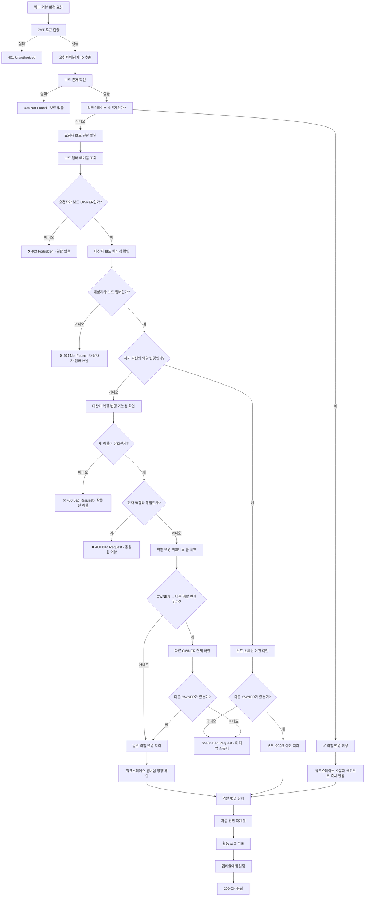

# 보드 멤버 역할 변경 권한 검증 플로우

## 🎯 개요

### 목적
이 문서는 보드 멤버의 역할 변경(OWNER ↔ EDITOR ↔ VIEWER)에 대한 권한 검증 플로우를 정의합니다.

### 범위
- **권한 검증 대상**: 보드 멤버의 역할 변경 작업
- **관련 역할**: OWNER, EDITOR, VIEWER
- **API 엔드포인트**: `PUT /api/v1/boards/{boardId}/members/{userId}/role`

## 🔐 권한 요구사항

### 최소 권한
- **워크스페이스**: 제한 없음 (워크스페이스 OWNER는 항상 허용)
- **보드**: OWNER (역할 변경 권한)
- **특별 조건**: 
  - 자기 자신의 역할은 변경할 수 없음 (보드 소유권 이전 제외)
  - 마지막 보드 OWNER는 역할을 변경할 수 없음

### 권한 우선순위
1. **워크스페이스 OWNER**: 모든 보드 멤버 역할 변경 가능
2. **보드 OWNER**: 다른 멤버의 역할 변경 가능 (자신 제외)
3. **보드 EDITOR/VIEWER**: 역할 변경 권한 없음

## 🔄 플로우 다이어그램



## 📝 검증 단계

### 1단계: 기본 인증 및 요청 검증
```javascript
// JWT 토큰 및 요청 파라미터 검증
const token = req.headers.authorization?.replace('Bearer ', '');
if (!token || !isValidToken(token)) {
    return res.status(401).json({ 
        code: 'INVALID_TOKEN',
        message: '인증이 필요합니다' 
    });
}

const requesterId = extractUserIdFromToken(token);
const { boardId, userId: targetUserId } = req.params;
const { role: newRole } = req.body;

// 새 역할 유효성 검증
const validRoles = ['OWNER', 'EDITOR', 'VIEWER'];
if (!validRoles.includes(newRole)) {
    return res.status(400).json({
        code: 'INVALID_ROLE',
        message: '유효하지 않은 역할입니다'
    });
}
```

### 2단계: 보드 및 워크스페이스 확인
```javascript
// 보드 존재 확인
const board = await boardRepository.findById(boardId);
if (!board) {
    throw new NotFoundException('보드를 찾을 수 없습니다');
}

// 워크스페이스 정보 조회
const workspace = await workspaceRepository.findById(board.workspaceId);

// 워크스페이스 소유자는 모든 권한
if (workspace.ownerId === requesterId) {
    return await executeRoleChange(targetUserId, boardId, newRole, requesterId, 'workspace_owner');
}
```

### 3단계: 요청자 권한 확인
```javascript
// 요청자의 보드 권한 확인
const requesterBoardMember = await boardMemberRepository.findByUserAndBoard(requesterId, boardId);
if (!requesterBoardMember || requesterBoardMember.role !== 'OWNER') {
    throw new ForbiddenException('보드 멤버의 역할을 변경할 권한이 없습니다. 보드 소유자만 가능합니다.');
}
```

### 4단계: 대상자 멤버십 및 역할 변경 가능성 확인
```javascript
// 대상자의 보드 멤버십 확인
const targetBoardMember = await boardMemberRepository.findByUserAndBoard(targetUserId, boardId);
if (!targetBoardMember) {
    throw new NotFoundException('대상 사용자는 이 보드의 멤버가 아닙니다');
}

// 현재 역할과 동일한지 확인
if (targetBoardMember.role === newRole) {
    throw new BadRequestException(`이미 ${newRole} 역할입니다`);
}

// 자기 자신의 역할 변경 확인
if (requesterId === targetUserId) {
    return await handleSelfRoleChange(requesterId, boardId, newRole, targetBoardMember.role);
}
```

### 5단계: 비즈니스 룰 검증
```javascript
// OWNER 역할 변경 시 다른 OWNER 존재 확인
if (targetBoardMember.role === 'OWNER' && newRole !== 'OWNER') {
    const ownerCount = await boardMemberRepository.countOwners(boardId);
    if (ownerCount <= 1) {
        throw new BadRequestException('마지막 보드 소유자의 역할은 변경할 수 없습니다');
    }
}

// 워크스페이스 멤버십에 미치는 영향 확인
await validateWorkspaceMembershipImpact(targetUserId, board.workspaceId, newRole);
```

## ⚠️ 예외 상황

### 실패 케이스
| 상황 | HTTP 상태 | 응답 코드 | 메시지 |
|------|-----------|-----------|--------|
| 토큰 없음/만료 | 401 | `INVALID_TOKEN` | "인증이 필요합니다" |
| 권한 없음 | 403 | `INSUFFICIENT_PERMISSION` | "보드 멤버의 역할을 변경할 권한이 없습니다" |
| 보드 없음 | 404 | `BOARD_NOT_FOUND` | "보드를 찾을 수 없습니다" |
| 대상자 멤버 아님 | 404 | `MEMBER_NOT_FOUND` | "대상 사용자는 이 보드의 멤버가 아닙니다" |
| 잘못된 역할 | 400 | `INVALID_ROLE` | "유효하지 않은 역할입니다" |
| 동일한 역할 | 400 | `SAME_ROLE` | "이미 해당 역할입니다" |
| 마지막 소유자 | 400 | `LAST_OWNER_CANNOT_CHANGE` | "마지막 보드 소유자의 역할은 변경할 수 없습니다" |
| 자기 역할 변경 | 400 | `CANNOT_CHANGE_OWN_ROLE` | "자신의 역할은 변경할 수 없습니다" |

### 특수 상황 처리

#### 1. 자기 자신의 역할 변경 (보드 소유권 이전)
```javascript
async function handleSelfRoleChange(userId, boardId, newRole, currentRole) {
    // OWNER가 자신의 역할을 변경하는 경우 = 보드 소유권 이전
    if (currentRole === 'OWNER') {
        const ownerCount = await boardMemberRepository.countOwners(boardId);
        if (ownerCount <= 1) {
            throw new BadRequestException('다른 소유자가 없어 역할을 변경할 수 없습니다. 먼저 다른 멤버를 소유자로 지정해주세요.');
        }
        
        // 보드 소유권 이전 처리
        return await transferBoardOwnership(userId, boardId, newRole);
    } else {
        // 비소유자가 자신의 역할 변경 시도
        throw new ForbiddenException('자신의 역할은 변경할 수 없습니다. 보드 소유자에게 요청해주세요.');
    }
}
```

#### 2. 워크스페이스 멤버십 영향 확인
```javascript
async function validateWorkspaceMembershipImpact(userId, workspaceId, newRole) {
    const workspaceMember = await workspaceMemberRepository.findByUserAndWorkspace(userId, workspaceId);
    
    // BOARD_ONLY 타입 사용자의 경우 특별 처리
    if (workspaceMember?.type === 'BOARD_ONLY') {
        // BOARD_ONLY 사용자가 OWNER가 되는 경우 워크스페이스 MEMBER로 승격 고려
        if (newRole === 'OWNER') {
            // 자동 승격 또는 관리자 승인 필요 여부 확인
            await considerWorkspaceMembershipUpgrade(userId, workspaceId);
        }
    }
}
```

#### 3. 공개 보드에서의 역할 변경
```javascript
async function handlePublicBoardRoleChange(userId, boardId, newRole, oldRole) {
    const board = await boardRepository.findById(boardId);
    
    if (board.isPublic) {
        const workspaceMember = await workspaceMemberRepository.findByUserAndWorkspace(userId, board.workspaceId);
        
        // 공개 보드에서 워크스페이스 정식 멤버가 VIEWER로 변경되는 경우
        if (workspaceMember?.type === 'MEMBER' && newRole === 'VIEWER') {
            // 워크스페이스 권한과 충돌하므로 경고 또는 거부
            throw new ConflictException('공개 보드에서 워크스페이스 멤버는 최소 EDITOR 권한을 가져야 합니다');
        }
    }
}
```

## 🔍 역할 변경 시나리오

### 시나리오별 세부 규칙

| 현재 역할 | 새 역할 | 허용 여부 | 특별 조건 |
|-----------|---------|-----------|-----------|
| OWNER | EDITOR | ✅ | 다른 OWNER 존재 필요 |
| OWNER | VIEWER | ✅ | 다른 OWNER 존재 필요 |
| EDITOR | OWNER | ✅ | 항상 가능 |
| EDITOR | VIEWER | ✅ | 항상 가능 |
| VIEWER | OWNER | ✅ | 항상 가능 |
| VIEWER | EDITOR | ✅ | 항상 가능 |

### 워크스페이스 타입별 영향

#### Personal 워크스페이스
- 보드 OWNER 변경 시 워크스페이스 소유권에는 영향 없음
- 모든 역할 변경이 보드 범위 내에서만 적용

#### Team 워크스페이스
- BOARD_ONLY → OWNER 승격 시 워크스페이스 MEMBER 승격 고려
- 공개 보드에서 워크스페이스 정식 멤버의 VIEWER 강등 제한

## 🧪 테스트 시나리오

### 성공 케이스
```javascript
describe('보드 멤버 역할 변경 - 성공', () => {
  test('워크스페이스 소유자는 모든 멤버 역할 변경 가능', async () => {
    const result = await changeBoardMemberRole(
      workspaceOwnerId, 
      boardId, 
      targetUserId, 
      'EDITOR'
    );
    expect(result.success).toBe(true);
    expect(result.reason).toBe('workspace_owner');
  });
  
  test('보드 소유자는 다른 멤버 역할 변경 가능', async () => {
    const result = await changeBoardMemberRole(
      boardOwnerId, 
      boardId, 
      editorUserId, 
      'VIEWER'
    );
    expect(result.success).toBe(true);
    expect(result.newRole).toBe('VIEWER');
  });
  
  test('EDITOR → OWNER 승격 가능', async () => {
    const result = await changeBoardMemberRole(
      boardOwnerId, 
      boardId, 
      editorUserId, 
      'OWNER'
    );
    expect(result.success).toBe(true);
    expect(result.newRole).toBe('OWNER');
  });
  
  test('OWNER → EDITOR 강등 (다른 OWNER 존재 시)', async () => {
    // 먼저 다른 멤버를 OWNER로 승격
    await changeBoardMemberRole(boardOwnerId, boardId, editorUserId, 'OWNER');
    
    // 기존 OWNER 강등
    const result = await changeBoardMemberRole(
      editorUserId, // 새로운 OWNER가 요청
      boardId, 
      boardOwnerId, // 기존 OWNER
      'EDITOR'
    );
    expect(result.success).toBe(true);
  });
});
```

### 실패 케이스
```javascript
describe('보드 멤버 역할 변경 - 실패', () => {
  test('권한 없는 사용자의 역할 변경 시도', async () => {
    await expect(changeBoardMemberRole(editorUserId, boardId, viewerUserId, 'OWNER'))
      .rejects.toThrow('보드 멤버의 역할을 변경할 권한이 없습니다');
  });
  
  test('마지막 OWNER의 역할 변경 시도', async () => {
    // 보드에 OWNER가 1명만 있는 상황
    await expect(changeBoardMemberRole(boardOwnerId, boardId, boardOwnerId, 'EDITOR'))
      .rejects.toThrow('마지막 보드 소유자의 역할은 변경할 수 없습니다');
  });
  
  test('존재하지 않는 멤버의 역할 변경', async () => {
    await expect(changeBoardMemberRole(boardOwnerId, boardId, 'nonexistent-user', 'EDITOR'))
      .rejects.toThrow('대상 사용자는 이 보드의 멤버가 아닙니다');
  });
  
  test('잘못된 역할로 변경 시도', async () => {
    await expect(changeBoardMemberRole(boardOwnerId, boardId, editorUserId, 'INVALID_ROLE'))
      .rejects.toThrow('유효하지 않은 역할입니다');
  });
  
  test('동일한 역할로 변경 시도', async () => {
    await expect(changeBoardMemberRole(boardOwnerId, boardId, editorUserId, 'EDITOR'))
      .rejects.toThrow('이미 EDITOR 역할입니다');
  });
  
  test('자기 자신의 역할 변경 시도 (비소유자)', async () => {
    await expect(changeBoardMemberRole(editorUserId, boardId, editorUserId, 'OWNER'))
      .rejects.toThrow('자신의 역할은 변경할 수 없습니다');
  });
});
```

### 특수 시나리오 테스트
```javascript
describe('보드 멤버 역할 변경 - 특수 시나리오', () => {
  test('공개 보드에서 워크스페이스 멤버를 VIEWER로 강등 시도', async () => {
    const publicBoard = await createPublicBoard(workspaceId);
    const workspaceMember = await addWorkspaceMember(workspaceId, 'MEMBER');
    
    await expect(changeBoardMemberRole(
      boardOwnerId, 
      publicBoard.id, 
      workspaceMember.id, 
      'VIEWER'
    )).rejects.toThrow('공개 보드에서 워크스페이스 멤버는 최소 EDITOR 권한을 가져야 합니다');
  });
  
  test('BOARD_ONLY 사용자를 OWNER로 승격', async () => {
    const boardOnlyUser = await inviteExternalUser(boardId, 'EDITOR');
    
    const result = await changeBoardMemberRole(
      boardOwnerId, 
      boardId, 
      boardOnlyUser.id, 
      'OWNER'
    );
    
    expect(result.success).toBe(true);
    
    // 워크스페이스 멤버십 확인
    const workspaceMember = await workspaceMemberRepository.findByUserAndWorkspace(
      boardOnlyUser.id, 
      workspaceId
    );
    expect(workspaceMember.type).toBe('BOARD_ONLY'); // 여전히 BOARD_ONLY 유지
  });
  
  test('마지막 OWNER가 다른 멤버를 OWNER로 승격 후 자신을 강등', async () => {
    // 1. 다른 멤버를 OWNER로 승격
    const result1 = await changeBoardMemberRole(
      boardOwnerId, 
      boardId, 
      editorUserId, 
      'OWNER'
    );
    expect(result1.success).toBe(true);
    
    // 2. 기존 OWNER가 자신을 EDITOR로 강등
    const result2 = await changeBoardMemberRole(
      editorUserId, // 새로운 OWNER가 변경
      boardId, 
      boardOwnerId, // 기존 OWNER
      'EDITOR'
    );
    expect(result2.success).toBe(true);
  });
});
```

## 🔗 관련 문서
- [권한 매트릭스](../permission-matrix.md)
- [보드 멤버 초대 플로우](./board-invite-flow.md)
- [보드 멤버 제거 플로우](./board-member-remove-flow.md)
- [워크스페이스 역할 변경 플로우](./workspace-role-change-flow.md)
- [보드 API 명세서](../../endpoints/board-api.md)

## 📚 구현 예시

### 백엔드 구현
```javascript
// 보드 멤버 역할 변경 핵심 로직
async function changeBoardMemberRole(requesterId, boardId, targetUserId, newRole) {
  // 1. 기본 검증
  await validateBasicRequirements(requesterId, boardId, targetUserId, newRole);
  
  // 2. 보드 및 워크스페이스 정보 조회
  const board = await boardRepository.findById(boardId);
  const workspace = await workspaceRepository.findById(board.workspaceId);
  
  // 3. 워크스페이스 소유자 권한 확인
  if (workspace.ownerId === requesterId) {
    return await executeRoleChange(targetUserId, boardId, newRole, requesterId, 'workspace_owner');
  }
  
  // 4. 요청자 권한 확인
  const requesterMember = await boardMemberRepository.findByUserAndBoard(requesterId, boardId);
  if (!requesterMember || requesterMember.role !== 'OWNER') {
    throw new ForbiddenException('보드 멤버의 역할을 변경할 권한이 없습니다');
  }
  
  // 5. 대상자 멤버십 확인
  const targetMember = await boardMemberRepository.findByUserAndBoard(targetUserId, boardId);
  if (!targetMember) {
    throw new NotFoundException('대상 사용자는 이 보드의 멤버가 아닙니다');
  }
  
  // 6. 비즈니스 룰 검증
  await validateRoleChangeRules(requesterId, targetUserId, boardId, targetMember.role, newRole);
  
  // 7. 역할 변경 실행
  return await executeRoleChange(targetUserId, boardId, newRole, requesterId, 'board_owner');
}

// 비즈니스 룰 검증
async function validateRoleChangeRules(requesterId, targetUserId, boardId, currentRole, newRole) {
  // 동일한 역할 확인
  if (currentRole === newRole) {
    throw new BadRequestException(`이미 ${newRole} 역할입니다`);
  }
  
  // 자기 자신의 역할 변경 확인
  if (requesterId === targetUserId) {
    throw new ForbiddenException('자신의 역할은 변경할 수 없습니다');
  }
  
  // OWNER 역할 변경 시 다른 OWNER 존재 확인
  if (currentRole === 'OWNER' && newRole !== 'OWNER') {
    const ownerCount = await boardMemberRepository.countOwners(boardId);
    if (ownerCount <= 1) {
      throw new BadRequestException('마지막 보드 소유자의 역할은 변경할 수 없습니다');
    }
  }
  
  // 공개 보드 워크스페이스 멤버 제한 확인
  await validatePublicBoardConstraints(targetUserId, boardId, newRole);
}

// 역할 변경 실행
async function executeRoleChange(targetUserId, boardId, newRole, changedBy, reason) {
  const transaction = await db.beginTransaction();
  
  try {
    // 1. 역할 변경
    const oldRole = await boardMemberRepository.updateRole(targetUserId, boardId, newRole);
    
    // 2. 권한 재계산 (공개 보드의 경우)
    await recalculatePermissions(targetUserId, boardId, newRole);
    
    // 3. 활동 로그 기록
    await activityRepository.create({
      type: 'BOARD_MEMBER_ROLE_CHANGED',
      userId: changedBy,
      boardId: boardId,
      payload: {
        targetUserId,
        oldRole,
        newRole,
        reason
      },
      timestamp: new Date()
    });
    
    // 4. 알림 발송
    await notificationService.sendRoleChangeNotification(
      targetUserId, 
      boardId, 
      oldRole, 
      newRole, 
      changedBy
    );
    
    await transaction.commit();
    
    return {
      success: true,
      targetUserId,
      oldRole,
      newRole,
      changedBy,
      reason
    };
    
  } catch (error) {
    await transaction.rollback();
    throw error;
  }
}

// 공개 보드 제약사항 확인
async function validatePublicBoardConstraints(userId, boardId, newRole) {
  const board = await boardRepository.findById(boardId);
  
  if (board.isPublic && newRole === 'VIEWER') {
    const workspaceMember = await workspaceMemberRepository.findByUserAndWorkspace(
      userId, 
      board.workspaceId
    );
    
    if (workspaceMember?.type === 'MEMBER') {
      throw new ConflictException(
        '공개 보드에서 워크스페이스 멤버는 최소 EDITOR 권한을 가져야 합니다'
      );
    }
  }
}

// 권한 재계산
async function recalculatePermissions(userId, boardId, newRole) {
  const board = await boardRepository.findById(boardId);
  
  // 공개 보드에서 역할이 변경된 경우 권한 타입 업데이트
  if (board.isPublic) {
    const workspaceMember = await workspaceMemberRepository.findByUserAndWorkspace(
      userId, 
      board.workspaceId
    );
    
    if (workspaceMember?.type === 'MEMBER') {
      // 워크스페이스 멤버의 경우 WORKSPACE_AUTO 타입 유지
      await boardMemberRepository.updateInvitationType(
        userId, 
        boardId, 
        'WORKSPACE_AUTO'
      );
    }
  }
}
```

### 프론트엔드 활용
```jsx
// 보드 멤버 역할 변경 컴포넌트
function MemberRoleSelector({ member, boardId, onRoleChange }) {
  const { canManageBoard } = usePermissions();
  const { user } = useAuth();
  const [isChanging, setIsChanging] = useState(false);
  
  const canChangeRole = canManageBoard(boardId) && member.userId !== user.id;
  
  const handleRoleChange = async (newRole) => {
    if (!canChangeRole || newRole === member.role) return;
    
    setIsChanging(true);
    try {
      await changeMemberRole(boardId, member.userId, newRole);
      onRoleChange?.(member.userId, newRole);
      
      // 성공 알림
      toast.success(`${member.name}님의 역할이 ${newRole}로 변경되었습니다`);
    } catch (error) {
      // 에러 처리
      if (error.code === 'LAST_OWNER_CANNOT_CHANGE') {
        toast.error('마지막 보드 소유자의 역할은 변경할 수 없습니다');
      } else {
        toast.error('역할 변경에 실패했습니다: ' + error.message);
      }
    } finally {
      setIsChanging(false);
    }
  };
  
if (!canChangeRole) {
    return (
      <div className="text-sm text-gray-600 px-3 py-2 bg-gray-50 rounded">
        {member.role}
      </div>
    );
  }

  return (
    <Select
      value={member.role}
      onValueChange={handleRoleChange}
      disabled={isChanging}
    >
      <SelectTrigger className="w-24">
        <SelectValue />
      </SelectTrigger>
      <SelectContent>
        <SelectItem value="OWNER">
          <div className="flex items-center space-x-2">
            <Crown className="w-4 h-4 text-yellow-500" />
            <span>소유자</span>
          </div>
        </SelectItem>
        <SelectItem value="EDITOR">
          <div className="flex items-center space-x-2">
            <Edit className="w-4 h-4 text-blue-500" />
            <span>편집자</span>
          </div>
        </SelectItem>
        <SelectItem value="VIEWER">
          <div className="flex items-center space-x-2">
            <Eye className="w-4 h-4 text-gray-500" />
            <span>조회자</span>
          </div>
        </SelectItem>
      </SelectContent>
    </Select>
  );
}

// 보드 멤버 관리 페이지
function BoardMembersPage({ boardId }) {
  const { members, loading, refetch } = useBoardMembers(boardId);
  const { canManageBoard } = usePermissions();
  
  const handleRoleChange = async (userId, newRole) => {
    // 상태 업데이트
    await refetch();
    
    // 실시간 동기화 (WebSocket)
    boardSocket.emit('member_role_changed', {
      boardId,
      userId,
      newRole
    });
  };
  
  if (loading) {
    return <div>로딩 중...</div>;
  }
  
  return (
    <div className="space-y-4">
      <div className="flex justify-between items-center">
        <h2 className="text-lg font-semibold">보드 멤버</h2>
        {canManageBoard(boardId) && (
          <Button onClick={() => setInviteModalOpen(true)}>
            <UserPlus className="w-4 h-4 mr-2" />
            멤버 초대
          </Button>
        )}
      </div>
      
      <div className="space-y-2">
        {members.map((member) => (
          <div key={member.userId} className="flex items-center justify-between p-3 border rounded-lg">
            <div className="flex items-center space-x-3">
              <Avatar>
                <AvatarImage src={member.profileImage} />
                <AvatarFallback>{member.name.charAt(0)}</AvatarFallback>
              </Avatar>
              <div>
                <div className="font-medium">{member.name}</div>
                <div className="text-sm text-gray-500">{member.email}</div>
              </div>
            </div>
            
            <div className="flex items-center space-x-2">
              <MemberRoleSelector
                member={member}
                boardId={boardId}
                onRoleChange={handleRoleChange}
              />
              
              {canManageBoard(boardId) && member.role !== 'OWNER' && (
                <Button
                  variant="ghost"
                  size="sm"
                  onClick={() => removeMember(member.userId)}
                  className="text-red-500 hover:text-red-700"
                >
                  <Trash2 className="w-4 h-4" />
                </Button>
              )}
            </div>
          </div>
        ))}
      </div>
    </div>
  );
}

// API 호출 함수
async function changeMemberRole(boardId, userId, newRole) {
  const response = await fetch(`/api/v1/boards/${boardId}/members/${userId}/role`, {
    method: 'PUT',
    headers: {
      'Content-Type': 'application/json',
      'Authorization': `Bearer ${getAuthToken()}`
    },
    body: JSON.stringify({ role: newRole })
  });
  
  if (!response.ok) {
    const error = await response.json();
    throw new Error(error.message);
  }
  


## 📊 모니터링 및 로깅

### 성능 지표
```javascript
// 역할 변경 성능 모니터링
const roleChangeMetrics = {
  // 평균 응답 시간
  avgResponseTime: '< 200ms',
  
  // 성공률
  successRate: '> 99.5%',
  
  // 동시 요청 처리
  concurrentRequests: '최대 100개/초',
  
  // 에러율
  errorRate: '< 0.5%'
};

// 로그 포맷
const auditLog = {
      timestamp: '2025-01-20T10:30:00.000Z',
  action: 'BOARD_MEMBER_ROLE_CHANGED',
  requesterId: 'user_123',
  targetUserId: 'user_456',
  boardId: 'board_789',
  workspaceId: 'workspace_abc',
  oldRole: 'EDITOR',
  newRole: 'OWNER',
  reason: 'board_owner',
  ipAddress: '192.168.1.100',
  userAgent: 'Mozilla/5.0...',
  success: true,
  executionTime: 150, // ms
  affectedPermissions: ['board:manage', 'content:delete']
};
```

### 알림 및 감사 로그
```javascript
// 역할 변경 알림 시스템
async function sendRoleChangeNotifications(changeData) {
  const { targetUserId, boardId, oldRole, newRole, changedBy } = changeData;
  
  // 1. 대상자에게 알림
  await notificationService.send({
    userId: targetUserId,
    type: 'ROLE_CHANGED',
    title: '보드 역할이 변경되었습니다',
    message: `${oldRole}에서 ${newRole}로 역할이 변경되었습니다`,
    data: { boardId, oldRole, newRole }
  });
  
  // 2. 다른 보드 소유자들에게 알림
  const boardOwners = await boardMemberRepository.findOwners(boardId);
  const otherOwners = boardOwners.filter(owner => owner.userId !== changedBy);
  
  for (const owner of otherOwners) {
    await notificationService.send({
      userId: owner.userId,
      type: 'MEMBER_ROLE_CHANGED',
      title: '보드 멤버 역할 변경',
      message: `${targetUser.name}님의 역할이 ${newRole}로 변경되었습니다`,
      data: { boardId, targetUserId, newRole }
    });
  }
  
  // 3. 워크스페이스 소유자에게 중요 변경사항 알림
  if (newRole === 'OWNER' || oldRole === 'OWNER') {
    const workspace = await workspaceRepository.findById(board.workspaceId);
    await notificationService.send({
      userId: workspace.ownerId,
      type: 'BOARD_OWNERSHIP_CHANGED',
      title: '보드 소유권 변경',
      message: `${board.name} 보드의 소유권이 변경되었습니다`,
      data: { boardId, targetUserId, oldRole, newRole }
    });
  }
}

// 감사 로그 기록
async function recordAuditLog(action, requestData, result, executionTime) {
  const auditEntry = {
    id: generateUuid(),
    timestamp: new Date(),
    action: action,
    category: 'BOARD_MANAGEMENT',
    severity: getSeverityLevel(action, result),
    requesterId: requestData.requesterId,
    targetUserId: requestData.targetUserId,
    resourceId: requestData.boardId,
    resourceType: 'BOARD',
    oldValue: result.oldRole,
    newValue: result.newRole,
    success: result.success,
    errorCode: result.errorCode,
    errorMessage: result.errorMessage,
    executionTime: executionTime,
    ipAddress: requestData.ipAddress,
    userAgent: requestData.userAgent,
    metadata: {
      workspaceId: result.workspaceId,
      reason: result.reason,
      affectedPermissions: result.affectedPermissions
    }
  };
  
  await auditLogRepository.create(auditEntry);
  
  // 중요한 변경사항은 별도 알림
  if (['OWNER'].includes(result.newRole) || ['OWNER'].includes(result.oldRole)) {
    await alertingService.sendSecurityAlert({
      type: 'BOARD_OWNERSHIP_CHANGE',
      severity: 'HIGH',
      details: auditEntry
    });
  }
}
```

## 🔧 트러블슈팅

### 자주 발생하는 문제

#### 1. 동시성 문제
**문제**: 여러 사용자가 동시에 같은 멤버의 역할을 변경하려고 할 때
**해결책**:
```javascript
// 낙관적 락킹 사용
async function changeMemberRoleWithLocking(requesterId, boardId, targetUserId, newRole) {
  const maxRetries = 3;
  let retryCount = 0;
  
  while (retryCount < maxRetries) {
    try {
      const member = await boardMemberRepository.findByUserAndBoardWithLock(
        targetUserId, 
        boardId
      );
      
      // 버전 확인
      if (member.version !== expectedVersion) {
        throw new ConflictException('다른 사용자가 이미 이 멤버의 정보를 수정했습니다');
      }
      
      return await executeRoleChange(targetUserId, boardId, newRole, requesterId);
      
    } catch (error) {
      if (error instanceof ConflictException && retryCount < maxRetries - 1) {
        retryCount++;
        await sleep(100 * retryCount); // 지수 백오프
        continue;
      }
      throw error;
    }
  }
}
```

#### 2. 권한 캐시 불일치
**문제**: 역할 변경 후 권한 캐시가 즉시 업데이트되지 않음
**해결책**:
```javascript
async function invalidatePermissionCache(userId, boardId) {
  // Redis 권한 캐시 무효화
  await redis.del(`permissions:user:${userId}:board:${boardId}`);
  await redis.del(`permissions:user:${userId}:workspace:*`);
  
  // 실시간 권한 업데이트 알림
  await websocketService.sendToUser(userId, {
    type: 'PERMISSION_UPDATED',
    boardId: boardId
  });
}
```

#### 3. 고아 권한 문제
**문제**: 보드에서 제거된 후에도 권한이 남아있는 경우
**해결책**:
```javascript
// 권한 정리 작업
async function cleanupOrphanedPermissions() {
  const orphanedPermissions = await permissionRepository.findOrphaned();
  
  for (const permission of orphanedPermissions) {
    await permissionRepository.delete(permission.id);
    await auditLogRepository.create({
      action: 'ORPHANED_PERMISSION_CLEANUP',
      resourceId: permission.resourceId,
      details: permission
    });
  }
}

// 스케줄러로 주기적 실행
cron.schedule('0 2 * * *', cleanupOrphanedPermissions); // 매일 새벽 2시
```

### 성능 최적화

#### 1. 벌크 역할 변경
```javascript
// 여러 멤버의 역할을 한 번에 변경
async function bulkChangeMemberRoles(requesterId, boardId, roleChanges) {
  const transaction = await db.beginTransaction();
  
  try {
    const results = [];
    
    // 권한 검증
    await validateBulkRoleChangePermission(requesterId, boardId, roleChanges);
    
    // 벌크 업데이트
    for (const change of roleChanges) {
      const result = await boardMemberRepository.updateRole(
        change.userId, 
        boardId, 
        change.newRole
      );
      results.push(result);
    }
    
    // 벌크 활동 로그
    await activityRepository.createBulk(
      roleChanges.map(change => ({
        type: 'BOARD_MEMBER_ROLE_CHANGED',
        userId: requesterId,
        boardId: boardId,
        payload: change
      }))
    );
    
    await transaction.commit();
    return results;
    
  } catch (error) {
    await transaction.rollback();
    throw error;
  }
}
```

#### 2. 권한 캐싱 전략
```javascript
// 계층적 권한 캐싱
class PermissionCache {
  constructor(redis) {
    this.redis = redis;
    this.ttl = 3600; // 1시간
  }
  
  async getUserBoardPermissions(userId, boardId) {
    const cacheKey = `permissions:${userId}:board:${boardId}`;
    const cached = await this.redis.get(cacheKey);
    
    if (cached) {
      return JSON.parse(cached);
    }
    
    const permissions = await this.calculatePermissions(userId, boardId);
    await this.redis.setex(cacheKey, this.ttl, JSON.stringify(permissions));
    
    return permissions;
  }
  
  async invalidateUserPermissions(userId, boardId = null) {
    if (boardId) {
      await this.redis.del(`permissions:${userId}:board:${boardId}`);
    } else {
      const pattern = `permissions:${userId}:*`;
      const keys = await this.redis.keys(pattern);
      if (keys.length > 0) {
        await this.redis.del(...keys);
      }
    }
  }
}
```

## 💡 베스트 프랙티스

### 1. 보안 고려사항
- 모든 역할 변경은 상세한 감사 로그 기록
- 중요한 역할 변경(OWNER 관련)은 별도 알림
- IP 주소, 사용자 에이전트 정보 기록
- 비정상적인 역할 변경 패턴 모니터링

### 2. 사용자 경험
- 역할 변경 시 즉각적인 피드백 제공
- 권한 변경으로 인한 기능 제한 사전 안내
- 실시간 권한 업데이트로 페이지 새로고침 불필요
- 명확한 에러 메시지와 해결 방안 제시

### 3. 개발 고려사항
- 역할 변경 로직의 단위 테스트 필수
- 동시성 시나리오 테스트 포함
- 권한 캐시 무효화 자동화
- 성능 모니터링 지표 설정

### 4. 운영 고려사항
- 역할 변경 빈도 모니터링
- 실패율 추적 및 알림 설정
- 정기적인 권한 정합성 검사
- 백업 및 복구 절차 문서화

## 🎯 개선 계획

### 단기 개선사항 (1-2 스프린트)
- [ ] 역할 변경 이력 UI 추가
- [ ] 벌크 역할 변경 기능 구현
- [ ] 권한 변경 미리보기 기능
- [ ] 모바일 앱에서의 역할 변경 지원

### 중기 개선사항 (3-6 스프린트)
- [ ] 조건부 역할 변경 (특정 날짜/조건까지)
- [ ] 역할 변경 승인 워크플로우
- [ ] 역할 템플릿 기능
- [ ] 고급 권한 분석 대시보드

### 장기 개선사항 (6+ 스프린트)
- [ ] AI 기반 역할 추천 시스템
- [ ] 역할 변경 패턴 분석
- [ ] 동적 권한 조정
- [ ] 통합 거버넌스 시스템

---

**문서 관리**
- **작성자**: 개발팀
- **검토자**: 보안팀, 제품팀
- **승인자**: 기술 리드
- **다음 검토 예정일**: 2025-02-17
```