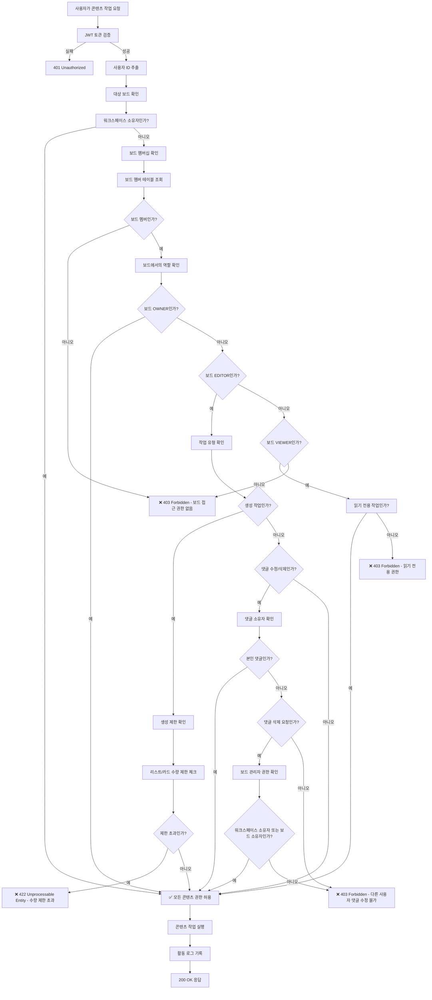

# 콘텐츠 권한 검증 플로우

## 🎯 개요

### 목적
이 문서는 콘텐츠(리스트, 카드, 댓글, 라벨) 생성/수정/삭제에 대한 권한 검증 플로우를 정의합니다.

### 범위
- **권한 검증 대상**: 리스트, 카드, 댓글, 라벨의 CRUD 작업
- **관련 역할**: OWNER, EDITOR, VIEWER
- **API 엔드포인트**: 
  - `POST/PUT/DELETE /api/v1/lists/**`
  - `POST/PUT/DELETE /api/v1/cards/**`
  - `POST/PUT/DELETE /api/v1/comments/**`
  - `POST/PUT/DELETE /api/v1/labels/**`

## 🔐 권한 요구사항

### 최소 권한
- **워크스페이스**: MEMBER (BOARD_ONLY는 개별 보드 권한 확인)
- **보드**: EDITOR 이상 (생성/수정/삭제), VIEWER (조회만)
- **특별 조건**: 
  - 댓글 수정: 본인 댓글만
  - 댓글 삭제: 본인 댓글 또는 보드/워크스페이스 관리자

### 권한 우선순위
1. **워크스페이스 OWNER**: 모든 콘텐츠 작업 허용
2. **보드 OWNER/EDITOR**: 모든 콘텐츠 작업 허용
3. **보드 VIEWER**: 조회만 허용
4. **특별 규칙**: 본인 댓글은 VIEWER도 수정/삭제 가능

## 🔄 플로우 다이어그램



## 📝 검증 단계

### 1단계: 인증 검증
```javascript
// JWT 토큰 유효성 검사
const token = req.headers.authorization?.replace('Bearer ', '');
if (!token || !isValidToken(token)) {
    return res.status(401).json({ 
        code: 'INVALID_TOKEN',
        message: '인증이 필요합니다' 
    });
}

const userId = extractUserIdFromToken(token);
```

### 2단계: 보드 확인 및 워크스페이스 소유자 권한
```javascript
// 요청에서 보드 ID 추출
const boardId = await extractBoardIdFromRequest(req);
const board = await boardRepository.findById(boardId);
if (!board) {
    throw new NotFoundException('보드를 찾을 수 없습니다');
}

// 워크스페이스 소유자 확인 (최고 권한)
const workspace = await workspaceRepository.findById(board.workspaceId);
if (workspace.ownerId === userId) {
    return { allowed: true, reason: 'workspace_owner' };
}
```

### 3단계: 보드 멤버십 및 역할 확인
```javascript
// 보드 멤버십 확인
const boardMember = await boardMemberRepository.findByUserAndBoard(userId, boardId);
if (!boardMember) {
    throw new ForbiddenException('보드에 접근할 권한이 없습니다');
}

// 읽기 전용 권한 확인
if (boardMember.role === 'VIEWER' && ['create', 'update', 'delete'].includes(action)) {
    throw new ForbiddenException('읽기 전용 권한으로는 콘텐츠를 수정할 수 없습니다');
}
```

### 4단계: 작업별 세부 검증
```javascript
// 생성 작업 시 수량 제한 확인
if (action === 'create') {
    await validateCreationLimits(boardId, resourceType, req.params);
}

// 댓글 수정/삭제 권한 확인
if (resourceType === 'comment' && ['update', 'delete'].includes(action)) {
    const commentId = req.params.commentId || req.params.id;
    await validateCommentPermission(userId, commentId, boardMember.role, workspace.ownerId);
}
```

## ⚠️ 예외 상황

### 실패 케이스
| 상황 | HTTP 상태 | 응답 코드 | 메시지 |
|------|-----------|-----------|--------|
| 토큰 없음/만료 | 401 | `INVALID_TOKEN` | "인증이 필요합니다" |
| 보드 접근 권한 없음 | 403 | `BOARD_ACCESS_DENIED` | "보드에 접근할 권한이 없습니다" |
| 읽기 전용 권한 | 403 | `READ_ONLY_ACCESS` | "읽기 전용 권한으로는 콘텐츠를 수정할 수 없습니다" |
| 리스트 수량 제한 | 422 | `LIST_LIMIT_EXCEEDED` | "보드당 최대 20개의 리스트만 생성할 수 있습니다" |
| 카드 수량 제한 | 422 | `CARD_LIMIT_EXCEEDED` | "리스트당 최대 100개의 카드만 생성할 수 있습니다" |
| 다른 사용자 댓글 수정 | 403 | `COMMENT_EDIT_DENIED` | "다른 사용자의 댓글을 수정할 권한이 없습니다" |
| 다른 사용자 댓글 삭제 | 403 | `COMMENT_DELETE_DENIED` | "다른 사용자의 댓글을 삭제할 권한이 없습니다" |

### 특수 상황 처리
- **수량 제한**: 리스트 20개, 카드 100개 제한으로 성능 최적화
- **댓글 권한**: 본인 댓글은 VIEWER도 수정/삭제 가능
- **관리자 댓글 삭제**: 워크스페이스 OWNER, 보드 OWNER만 타인 댓글 삭제 가능

## 🔍 콘텐츠별 세부 권한

### 리스트 관련 권한
| 작업 | OWNER | EDITOR | VIEWER | 제한사항 |
|------|:-----:|:------:|:------:|----------|
| 생성 | ✅ | ✅ | ❌ | 보드당 최대 20개 |
| 조회 | ✅ | ✅ | ✅ | - |
| 수정 | ✅ | ✅ | ❌ | 이름, 색상, 순서 |
| 삭제 | ✅ | ✅ | ❌ | 포함된 카드도 함께 삭제 |

### 카드 관련 권한
| 작업 | OWNER | EDITOR | VIEWER | 제한사항 |
|------|:-----:|:------:|:------:|----------|
| 생성 | ✅ | ✅ | ❌ | 리스트당 최대 100개 |
| 조회 | ✅ | ✅ | ✅ | - |
| 수정 | ✅ | ✅ | ❌ | 제목, 설명, 위치 |
| 삭제 | ✅ | ✅ | ❌ | 댓글, 첨부파일도 함께 삭제 |
| 이동 | ✅ | ✅ | ❌ | 같은 보드 내에서만 |
| 복제 | ✅ | ✅ | ❌ | 대상 리스트 수량 제한 확인 |

### 댓글 관련 권한
| 작업 | OWNER | EDITOR | VIEWER | 특별 규칙 |
|------|:-----:|:------:|:------:|-----------|
| 작성 | ✅ | ✅ | ❌ | - |
| 조회 | ✅ | ✅ | ✅ | - |
| 수정 | ✅ | ✅ | ❌ | **본인 댓글은 VIEWER도 가능** |
| 삭제 | ✅ | ✅ | ❌ | **본인 댓글은 VIEWER도 가능**<br/>**관리자는 타인 댓글도 삭제 가능** |

### 라벨 관련 권한
| 작업 | OWNER | EDITOR | VIEWER | 제한사항 |
|------|:-----:|:------:|:------:|----------|
| 생성 | ✅ | ✅ | ❌ | 보드 범위 |
| 조회 | ✅ | ✅ | ✅ | - |
| 수정 | ✅ | ✅ | ❌ | 이름, 색상 |
| 삭제 | ✅ | ✅ | ❌ | 사용 중인 라벨 삭제 시 카드에서 제거 |
| 카드 적용/제거 | ✅ | ✅ | ❌ | - |

## 🧪 테스트 시나리오

### 성공 케이스
```javascript
describe('콘텐츠 권한 검증 - 성공', () => {
  test('워크스페이스 소유자는 모든 콘텐츠 작업 허용', async () => {
    const result = await checkContentPermission(workspaceOwnerId, boardId, 'create', 'card');
    expect(result.allowed).toBe(true);
    expect(result.reason).toBe('workspace_owner');
  });
  
  test('보드 EDITOR는 콘텐츠 생성/수정/삭제 허용', async () => {
    const result = await checkContentPermission(editorUserId, boardId, 'create', 'list');
    expect(result.allowed).toBe(true);
    expect(result.reason).toBe('board_editor');
  });
  
  test('본인 댓글은 VIEWER도 수정 가능', async () => {
    const comment = await createComment(viewerUserId, cardId, 'test comment');
    const result = await checkContentPermission(viewerUserId, boardId, 'update', 'comment', comment.id);
    expect(result.allowed).toBe(true);
  });
  
  test('관리자는 타인 댓글 삭제 가능', async () => {
    const comment = await createComment(editorUserId, cardId, 'test comment');
    const result = await checkContentPermission(boardOwnerId, boardId, 'delete', 'comment', comment.id);
    expect(result.allowed).toBe(true);
    expect(result.reason).toBe('admin_privilege');
  });
});
```

### 실패 케이스
```javascript
describe('콘텐츠 권한 검증 - 실패', () => {
  test('보드 VIEWER는 콘텐츠 생성 불가', async () => {
    await expect(checkContentPermission(viewerUserId, boardId, 'create', 'card'))
      .rejects.toThrow('읽기 전용 권한으로는 콘텐츠를 수정할 수 없습니다');
  });
  
  test('리스트 수량 제한 초과 시 실패', async () => {
    // 20개 리스트 생성 후
    await createMaxLists(boardId, 20);
    
    await expect(checkContentPermission(editorUserId, boardId, 'create', 'list'))
      .rejects.toThrow('보드당 최대 20개의 리스트만 생성할 수 있습니다');
  });
  
  test('다른 사용자 댓글 수정 시도 시 실패', async () => {
    const comment = await createComment(editorUserId, cardId, 'test comment');
    
    await expect(checkContentPermission(viewerUserId, boardId, 'update', 'comment', comment.id))
      .rejects.toThrow('다른 사용자의 댓글을 수정할 권한이 없습니다');
  });
  
  test('보드 멤버가 아닌 사용자 접근 시 실패', async () => {
    await expect(checkContentPermission(outsiderUserId, boardId, 'read', 'card'))
      .rejects.toThrow('보드에 접근할 권한이 없습니다');
  });
});
```

### 경계값 테스트
```javascript
describe('콘텐츠 권한 검증 - 경계값', () => {
  test('리스트 19개일 때 추가 생성 가능', async () => {
    await createLists(boardId, 19);
    
    const result = await checkContentPermission(editorUserId, boardId, 'create', 'list');
    expect(result.allowed).toBe(true);
  });
  
  test('리스트 20개일 때 추가 생성 불가', async () => {
    await createLists(boardId, 20);
    
    await expect(checkContentPermission(editorUserId, boardId, 'create', 'list'))
      .rejects.toThrow(UnprocessableEntityException);
  });
  
  test('카드 99개일 때 추가 생성 가능', async () => {
    await createCards(listId, 99);
    
    const result = await checkContentPermission(editorUserId, boardId, 'create', 'card');
    expect(result.allowed).toBe(true);
  });
  
  test('카드 100개일 때 추가 생성 불가', async () => {
    await createCards(listId, 100);
    
    await expect(checkContentPermission(editorUserId, boardId, 'create', 'card'))
      .rejects.toThrow('리스트당 최대 100개의 카드만 생성할 수 있습니다');
  });
});
```

## 🔗 관련 문서
- [권한 매트릭스](../permission-matrix.md)
- [보드 권한 플로우](./board-edit-flow.md)
- [댓글 API 명세서](../../endpoints/comment-api.md)
- [사용자 역할 정의](../README.md#사용자-역할)
- [오류 코드 정의](../../error-codes.md)

## 📚 구현 예시

### 백엔드 구현
```javascript
// 콘텐츠 권한 검증 핵심 로직
async function checkContentPermission(userId, boardId, action, resourceType, resourceId = null) {
  // 1. 보드 정보 조회
  const board = await boardRepository.findById(boardId);
  if (!board) {
    throw new NotFoundException('보드를 찾을 수 없습니다');
  }
  
  // 2. 워크스페이스 소유자 확인 (최고 권한)
  const workspace = await workspaceRepository.findById(board.workspaceId);
  if (workspace.ownerId === userId) {
    return { allowed: true, reason: 'workspace_owner' };
  }
  
  // 3. 보드 멤버십 확인
  const boardMember = await boardMemberRepository.findByUserAndBoard(userId, boardId);
  if (!boardMember) {
    throw new ForbiddenException('보드에 접근할 권한이 없습니다');
  }
  
  // 4. 읽기 전용 권한 확인
  if (boardMember.role === 'VIEWER' && ['create', 'update', 'delete'].includes(action)) {
    // 예외: 본인 댓글은 VIEWER도 수정/삭제 가능
    if (resourceType === 'comment' && resourceId) {
      const comment = await commentRepository.findById(resourceId);
      if (comment && comment.authorId === userId) {
        return { allowed: true, reason: 'own_comment' };
      }
    }
    throw new ForbiddenException('읽기 전용 권한으로는 콘텐츠를 수정할 수 없습니다');
  }
  
  // 5. 생성 작업 시 수량 제한 확인
  if (action === 'create') {
    await validateCreationLimits(boardId, resourceType);
  }
  
  // 6. 댓글 수정/삭제 권한 확인
  if (resourceType === 'comment' && ['update', 'delete'].includes(action) && resourceId) {
    await validateCommentPermission(userId, resourceId, boardMember.role, workspace.ownerId);
  }
  
  return { allowed: true, reason: `board_${boardMember.role.toLowerCase()}` };
}

// 생성 제한 검증
async function validateCreationLimits(boardId, resourceType) {
  if (resourceType === 'list') {
    const listCount = await listRepository.countByBoard(boardId);
    if (listCount >= 20) {
      throw new UnprocessableEntityException('보드당 최대 20개의 리스트만 생성할 수 있습니다');
    }
  } else if (resourceType === 'card') {
    const listId = arguments[2]; // 추가 파라미터로 listId 받음
    const cardCount = await cardRepository.countByList(listId);
    if (cardCount >= 100) {
      throw new UnprocessableEntityException('리스트당 최대 100개의 카드만 생성할 수 있습니다');
    }
  }
}

// 댓글 권한 검증
async function validateCommentPermission(userId, commentId, userBoardRole, workspaceOwnerId) {
  const comment = await commentRepository.findById(commentId);
  if (!comment) {
    throw new NotFoundException('댓글을 찾을 수 없습니다');
  }
  
  // 자신의 댓글은 항상 수정/삭제 가능
  if (comment.authorId === userId) {
    return true;
  }
  
  // 다른 사용자의 댓글 삭제는 워크스페이스 소유자 또는 보드 소유자만 가능
  if (userId === workspaceOwnerId || userBoardRole === 'OWNER') {
    return true;
  }
  
  throw new ForbiddenException('다른 사용자의 댓글을 수정/삭제할 권한이 없습니다');
}

// 요청에서 보드 ID 추출
async function extractBoardIdFromRequest(req) {
  // 직접 보드 ID가 있는 경우
  if (req.params.boardId || req.params.id) {
    return req.params.boardId || req.params.id;
  }
  
  // 리스트를 통해 보드 ID 추출
  if (req.params.listId) {
    const list = await listRepository.findById(req.params.listId);
    return list?.boardId;
  }
  
  // 카드를 통해 보드 ID 추출
  if (req.params.cardId) {
    const card = await cardRepository.findById(req.params.cardId);
    const list = await listRepository.findById(card?.listId);
    return list?.boardId;
  }
  
  // 댓글을 통해 보드 ID 추출
  if (req.params.commentId) {
    const comment = await commentRepository.findById(req.params.commentId);
    const card = await cardRepository.findById(comment?.cardId);
    const list = await listRepository.findById(card?.listId);
    return list?.boardId;
  }
  
  throw new BadRequestException('요청에서 보드 ID를 확인할 수 없습니다');
}
```

### 프론트엔드 활용
```jsx
// 권한 기반 콘텐츠 렌더링
function ContentActions({ boardId, resourceType, resourceId }) {
  const { canEditBoard, canManageBoard } = usePermissions();
  const canEdit = canEditBoard(boardId);
  const canManage = canManageBoard(boardId);
  
  return (
    <div className="flex space-x-2">
      {/* 읽기는 모든 사용자 가능 */}
      <button onClick={() => viewContent(resourceId)}>
        보기
      </button>
      
      {/* 편집은 EDITOR 이상 */}
      {canEdit && (
        <button onClick={() => editContent(resourceId)}>
          수정
        </button>
      )}
      
      {/* 삭제는 EDITOR 이상 (댓글은 예외 처리) */}
      {canEdit && (
        <button onClick={() => deleteContent(resourceType, resourceId)}>
          삭제
        </button>
      )}
      
      {/* 관리 기능은 OWNER만 */}
      {canManage && resourceType === 'board' && (
        <button onClick={() => manageContent(resourceId)}>
          관리
        </button>
      )}
    </div>
  );
}

// 댓글 권한 처리
function CommentComponent({ comment, boardId }) {
  const { user } = useAuth();
  const { canEditBoard, canManageBoard } = usePermissions();
  
  const canEdit = canEditBoard(boardId);
  const canManage = canManageBoard(boardId);
  const isOwnComment = comment.authorId === user.id;
  
  // 본인 댓글은 VIEWER도 수정/삭제 가능
  const canEditComment = isOwnComment || canEdit;
  const canDeleteComment = isOwnComment || canManage;
  
  return (
    <div className="comment">
      <p>{comment.content}</p>
      
      <div className="actions">
        {canEditComment && (
          <button onClick={() => editComment(comment.id)}>
            수정
          </button>
        )}
        
        {canDeleteComment && (
          <button onClick={() => deleteComment(comment.id)}>
            삭제
          </button>
        )}
      </div>
    </div>
  );
}
```

## 📋 체크리스트

### 구현 완료 체크리스트
- [x] 백엔드 콘텐츠 권한 검증 로직 구현
- [x] API 엔드포인트 권한 미들웨어 적용
- [x] 생성 제한 검증 로직 구현
- [x] 댓글 권한 특수 처리 로직 구현
- [x] 프론트엔드 권한 확인 Hook 구현
- [x] UI 컴포넌트 권한 기반 렌더링
- [x] 단위 테스트 작성
- [x] 통합 테스트 작성
- [x] API 문서 업데이트

### 리뷰 체크리스트
- [x] 보안 검토 완료
- [x] 성능 테스트 완료
- [x] 접근성 검토 완료
- [x] 다국어 메시지 검토 완료
- [x] 수량 제한 성능 영향 분석 완료

## 📝 변경 이력
| 날짜 | 버전 | 변경 내용 | 담당자 |
|------|------|-----------|--------|
| 2025-01-20 | 1.0 | 초기 문서 작성 | 개발팀 |

## 💬 FAQ

### Q: VIEWER가 본인 댓글을 수정할 수 있는 이유는?
A: 댓글은 개인의 의견 표현이므로, 보드 접근 권한이 있다면 본인이 작성한 댓글에 대해서는 수정/삭제 권한을 부여합니다. 이는 사용자 경험을 개선하기 위한 설계입니다.

### Q: 리스트/카드 수량 제한을 왜 두었나요?
A: 대량의 콘텐츠로 인한 성능 저하를 방지하고, 사용자에게 적절한 규모의 프로젝트 관리를 유도하기 위함입니다. 실제 사용 패턴을 분석하여 합리적인 제한값을 설정했습니다.

### Q: 관리자가 타인의 댓글을 삭제할 수 있는 범위는?
A: 워크스페이스 소유자는 워크스페이스 내 모든 댓글을, 보드 소유자는 해당 보드 내 모든 댓글을 삭제할 수 있습니다. 이는 커뮤니티 관리 및 부적절한 콘텐츠 제거를 위한 기능입니다.