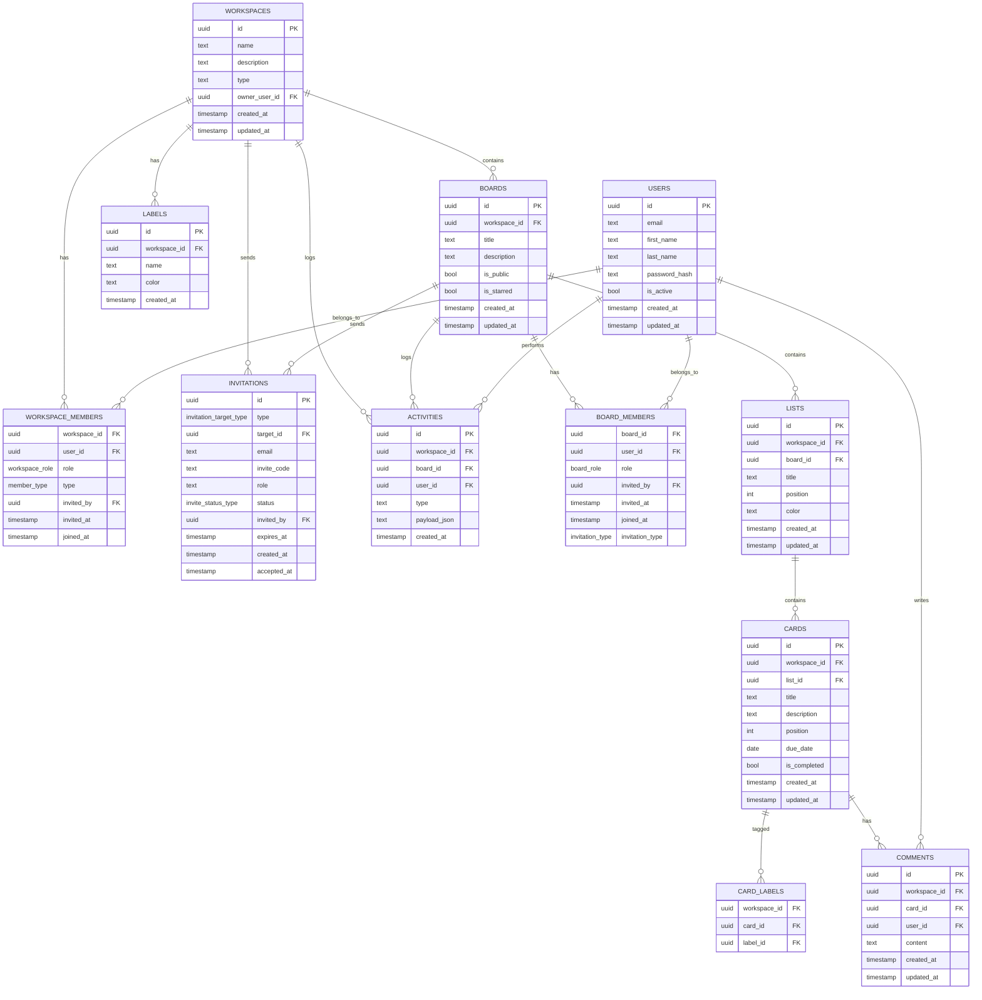

# 데이터 모델 및 마이그레이션

관계형 스키마와 마이그레이션 정책을 요약합니다.

## 멀티테넌시 전략
- 테넌트 경계는 `workspace_id` 외래키로 구현(Board, List, Card, Label, Activity, Invitation 등).
- 테넌트 로컬 고유성은 `workspace_id`를 포함한 복합 Unique 제약으로 보장.
- 모든 조회는 `workspace_id` 기준으로 필터링.

## 워크스페이스 타입 및 권한 체계

### 워크스페이스 타입
- **PERSONAL**: 개인 전용 워크스페이스 (멤버 초대 불가, 소유자만 접근)
- **TEAM**: 팀 협업 워크스페이스 (멤버 초대 및 협업 가능)

### 사용자 타입 및 권한
- **워크스페이스 역할**: OWNER, MEMBER
- **멤버 타입**: MEMBER (정식 멤버), BOARD_ONLY (보드에만 초대받은 사용자)
- **보드 역할**: OWNER, EDITOR, VIEWER
- **권한 우선순위**: 워크스페이스 OWNER > 워크스페이스 MEMBER > BOARD_ONLY

### 보드 공개 설정
- **공개 보드**: 워크스페이스 정식 멤버에게 자동 Editor 권한 부여
- **비공개 보드**: 개별 초대를 통해서만 접근 가능

## 주요 테이블

### 핵심 엔티티
- **workspaces**(id, name, description, type, owner_user_id, created_at, updated_at)
- **boards**(id, workspace_id, title, description, is_public, is_starred, is_archived, created_at, updated_at)
- **lists**(id, workspace_id, board_id, title, position, color, created_at, updated_at)
- **cards**(id, workspace_id, list_id, title, description, position, due_date, is_completed, created_at, updated_at)

### 권한 관리
- **workspace_members**(workspace_id, user_id, role, type, invited_by, invited_at, joined_at)
- **board_members**(board_id, user_id, role, invited_by, invited_at, joined_at, invitation_type)

### 초대 관리
- **invitations**(id, type, target_id, email, invite_code, role, status, invited_by, expires_at, created_at, accepted_at)

### 콘텐츠 관리
- **labels**(id, workspace_id, name, color, created_at)
- **card_labels**(workspace_id, card_id, label_id)
- **comments**(id, workspace_id, card_id, user_id, content, created_at, updated_at)
- **activities**(id, workspace_id, board_id, user_id, type, payload_json, created_at)

## 권한 매트릭스 구현

### 워크스페이스 권한
```sql
-- 워크스페이스 역할 enum
CREATE TYPE workspace_role AS ENUM ('OWNER', 'MEMBER');

-- 멤버 타입 enum
CREATE TYPE member_type AS ENUM ('MEMBER', 'BOARD_ONLY');

-- 워크스페이스 멤버 테이블
CREATE TABLE workspace_members (
    workspace_id UUID REFERENCES workspaces(id) ON DELETE CASCADE,
    user_id UUID REFERENCES users(id) ON DELETE CASCADE,
    role workspace_role NOT NULL DEFAULT 'MEMBER',
    type member_type NOT NULL DEFAULT 'MEMBER',
    invited_by UUID REFERENCES users(id),
    invited_at TIMESTAMP,
    joined_at TIMESTAMP NOT NULL DEFAULT NOW(),
    PRIMARY KEY (workspace_id, user_id)
);
```

### 보드 권한
```sql
-- 보드 역할 enum
CREATE TYPE board_role AS ENUM ('OWNER', 'EDITOR', 'VIEWER');

-- 초대 타입 enum
CREATE TYPE invitation_type AS ENUM ('WORKSPACE_AUTO', 'INDIVIDUAL');

-- 보드 멤버 테이블
CREATE TABLE board_members (
    board_id UUID REFERENCES boards(id) ON DELETE CASCADE,
    user_id UUID REFERENCES users(id) ON DELETE CASCADE,
    role board_role NOT NULL DEFAULT 'VIEWER',
    invited_by UUID REFERENCES users(id),
    invited_at TIMESTAMP,
    joined_at TIMESTAMP NOT NULL DEFAULT NOW(),
    invitation_type invitation_type NOT NULL DEFAULT 'INDIVIDUAL',
    PRIMARY KEY (board_id, user_id)
);
```

### 초대 상태 관리
```sql
-- 초대 상태 enum
CREATE TYPE invite_status_type AS ENUM ('PENDING', 'ACCEPTED', 'DECLINED', 'EXPIRED');

-- 초대 타입 enum
CREATE TYPE invitation_target_type AS ENUM ('WORKSPACE', 'BOARD');

-- 초대 테이블 (워크스페이스 및 보드 통합)
CREATE TABLE invitations (
    id UUID PRIMARY KEY DEFAULT gen_random_uuid(),
    type invitation_target_type NOT NULL,
    target_id UUID NOT NULL,
    email VARCHAR(255),
    invite_code VARCHAR(255) UNIQUE,
    role VARCHAR(50) NOT NULL,
    status invite_status_type NOT NULL DEFAULT 'PENDING',
    invited_by UUID REFERENCES users(id),
    expires_at TIMESTAMP NOT NULL DEFAULT (NOW() + INTERVAL '7 days'),
    created_at TIMESTAMP NOT NULL DEFAULT NOW(),
    accepted_at TIMESTAMP,
    CHECK ((email IS NOT NULL AND invite_code IS NULL) OR (email IS NULL AND invite_code IS NOT NULL))
);
```

### 핵심 엔티티 테이블
```sql
-- 워크스페이스 테이블
CREATE TABLE workspaces (
    id UUID PRIMARY KEY DEFAULT gen_random_uuid(),
    name VARCHAR(255) NOT NULL,
    description TEXT,
    type VARCHAR(20) NOT NULL CHECK (type IN ('PERSONAL', 'TEAM')),
    owner_user_id UUID REFERENCES users(id) ON DELETE CASCADE,
    is_archived BOOLEAN NOT NULL DEFAULT FALSE,
    created_at TIMESTAMP NOT NULL DEFAULT NOW(),
    updated_at TIMESTAMP NOT NULL DEFAULT NOW(),
    UNIQUE(owner_user_id, name)
);

-- 보드 테이블
CREATE TABLE boards (
    id UUID PRIMARY KEY DEFAULT gen_random_uuid(),
    workspace_id UUID REFERENCES workspaces(id) ON DELETE CASCADE,
    title VARCHAR(255) NOT NULL,
    description TEXT,
    is_public BOOLEAN NOT NULL DEFAULT TRUE,
    is_starred BOOLEAN NOT NULL DEFAULT FALSE,
    is_archived BOOLEAN NOT NULL DEFAULT FALSE,
    created_at TIMESTAMP NOT NULL DEFAULT NOW(),
    updated_at TIMESTAMP NOT NULL DEFAULT NOW()
);

-- 리스트 테이블
CREATE TABLE lists (
    id UUID PRIMARY KEY DEFAULT gen_random_uuid(),
    workspace_id UUID REFERENCES workspaces(id) ON DELETE CASCADE,
    board_id UUID REFERENCES boards(id) ON DELETE CASCADE,
    title VARCHAR(255) NOT NULL,
    position INTEGER NOT NULL,
    color VARCHAR(7),
    created_at TIMESTAMP NOT NULL DEFAULT NOW(),
    updated_at TIMESTAMP NOT NULL DEFAULT NOW(),
    UNIQUE(workspace_id, board_id, position)
);

-- 카드 테이블
CREATE TABLE cards (
    id UUID PRIMARY KEY DEFAULT gen_random_uuid(),
    workspace_id UUID REFERENCES workspaces(id) ON DELETE CASCADE,
    list_id UUID REFERENCES lists(id) ON DELETE CASCADE,
    title VARCHAR(255) NOT NULL,
    description TEXT,
    position INTEGER NOT NULL,
    due_date DATE,
    is_completed BOOLEAN NOT NULL DEFAULT FALSE,
    created_at TIMESTAMP NOT NULL DEFAULT NOW(),
    updated_at TIMESTAMP NOT NULL DEFAULT NOW(),
    UNIQUE(workspace_id, list_id, position)
);

-- 라벨 테이블
CREATE TABLE labels (
    id UUID PRIMARY KEY DEFAULT gen_random_uuid(),
    workspace_id UUID REFERENCES workspaces(id) ON DELETE CASCADE,
    name VARCHAR(100) NOT NULL,
    color VARCHAR(7) NOT NULL,
    created_at TIMESTAMP NOT NULL DEFAULT NOW(),
    UNIQUE(workspace_id, name)
);

-- 카드-라벨 관계 테이블
CREATE TABLE card_labels (
    workspace_id UUID REFERENCES workspaces(id) ON DELETE CASCADE,
    card_id UUID REFERENCES cards(id) ON DELETE CASCADE,
    label_id UUID REFERENCES labels(id) ON DELETE CASCADE,
    PRIMARY KEY (workspace_id, card_id, label_id)
);

-- 댓글 테이블
CREATE TABLE comments (
    id UUID PRIMARY KEY DEFAULT gen_random_uuid(),
    workspace_id UUID REFERENCES workspaces(id) ON DELETE CASCADE,
    card_id UUID REFERENCES cards(id) ON DELETE CASCADE,
    user_id UUID REFERENCES users(id) ON DELETE CASCADE,
    content TEXT NOT NULL,
    created_at TIMESTAMP NOT NULL DEFAULT NOW(),
    updated_at TIMESTAMP NOT NULL DEFAULT NOW()
);

-- 활동 로그 테이블
CREATE TABLE activities (
    id UUID PRIMARY KEY DEFAULT gen_random_uuid(),
    workspace_id UUID REFERENCES workspaces(id) ON DELETE CASCADE,
    board_id UUID REFERENCES boards(id) ON DELETE CASCADE,
    user_id UUID REFERENCES users(id) ON DELETE CASCADE,
    type VARCHAR(50) NOT NULL,
    payload_json JSONB,
    created_at TIMESTAMP NOT NULL DEFAULT NOW()
);
```

## 데이터 정합성 규칙

### 워크스페이스 멤버십 규칙
```sql
-- Personal 워크스페이스는 OWNER 1명만 허용
CREATE OR REPLACE FUNCTION check_personal_workspace_owner()
RETURNS TRIGGER AS $$
BEGIN
    IF EXISTS (
        SELECT 1 FROM workspaces w
        JOIN workspace_members wm ON w.id = wm.workspace_id
        WHERE w.type = 'PERSONAL' AND wm.role = 'OWNER'
        AND wm.workspace_id = NEW.workspace_id
        GROUP BY wm.workspace_id
        HAVING COUNT(*) > 1
    ) THEN
        RAISE EXCEPTION 'Personal 워크스페이스는 OWNER 1명만 허용됩니다';
    END IF;
    RETURN NEW;
END;
$$ LANGUAGE plpgsql;

CREATE TRIGGER trigger_check_personal_workspace_owner
    AFTER INSERT OR UPDATE ON workspace_members
    FOR EACH ROW EXECUTE FUNCTION check_personal_workspace_owner();

-- BOARD_ONLY 타입은 항상 MEMBER 역할만 가능
ALTER TABLE workspace_members 
ADD CONSTRAINT check_board_only_role 
CHECK (type != 'BOARD_ONLY' OR role = 'MEMBER');
```

### 보드 멤버십 규칙
```sql
-- WORKSPACE_AUTO는 워크스페이스 정식 멤버만 가능
CREATE OR REPLACE FUNCTION check_workspace_auto_member()
RETURNS TRIGGER AS $$
BEGIN
    IF NEW.invitation_type = 'WORKSPACE_AUTO' THEN
        IF NOT EXISTS (
            SELECT 1 FROM workspace_members wm
            WHERE wm.user_id = NEW.user_id 
            AND wm.workspace_id = (
                SELECT workspace_id FROM boards WHERE id = NEW.board_id
            )
            AND wm.type = 'MEMBER'
        ) THEN
            RAISE EXCEPTION 'WORKSPACE_AUTO 권한은 워크스페이스 정식 멤버만 가능합니다';
        END IF;
    END IF;
    RETURN NEW;
END;
$$ LANGUAGE plpgsql;

CREATE TRIGGER trigger_check_workspace_auto_member
    AFTER INSERT OR UPDATE ON board_members
    FOR EACH ROW EXECUTE FUNCTION check_workspace_auto_member();
```

## Flyway 마이그레이션
- 공통: `/backend/boardly-infrastructure/src/main/resources/db/migration/common` (예: `V2__workspace_multi_tenant.sql`, `V3__migrate_workspace_initial_data.sql`)
- 환경별 시드: `/db/migration/{local,dev}/R__insert_*_dummy_data.sql`
- 정책
  - 모든 스키마 변경은 버전 스크립트 `V__`로.
  - 데이터 보정은 반복 스크립트 `R__`로, 멱등 가드 포함.
  - 적용된 마이그레이션은 수정하지 않고 새 `V__`를 추가.

## ERD(Mermaid)


## 인덱스 최적화

### 권한 검증 최적화
```sql
-- 워크스페이스 멤버십 조회 최적화
CREATE INDEX idx_workspace_members_user_workspace ON workspace_members(user_id, workspace_id);
CREATE INDEX idx_workspace_members_type ON workspace_members(workspace_id, type);
CREATE INDEX idx_workspace_members_role ON workspace_members(workspace_id, role);

-- 보드 멤버십 조회 최적화
CREATE INDEX idx_board_members_user_board ON board_members(user_id, board_id);
CREATE INDEX idx_board_members_invitation_type ON board_members(board_id, invitation_type);
CREATE INDEX idx_board_members_role ON board_members(board_id, role);

-- 초대 조회 최적화
CREATE INDEX idx_invitations_email_status ON invitations(email, status);
CREATE INDEX idx_invitations_invite_code ON invitations(invite_code);
CREATE INDEX idx_invitations_expires_at ON invitations(expires_at);
CREATE INDEX idx_invitations_type_target ON invitations(type, target_id);
CREATE INDEX idx_invitations_status_created ON invitations(status, created_at);
```

### 콘텐츠 조회 최적화
```sql
-- 리스트 조회 최적화
CREATE INDEX idx_lists_workspace_board ON lists(workspace_id, board_id);
CREATE INDEX idx_lists_position ON lists(workspace_id, board_id, position);

-- 카드 조회 최적화
CREATE INDEX idx_cards_workspace_list ON cards(workspace_id, list_id);
CREATE INDEX idx_cards_position ON cards(workspace_id, list_id, position);
CREATE INDEX idx_cards_due_date ON cards(workspace_id, due_date);
CREATE INDEX idx_cards_completed ON cards(workspace_id, is_completed);

-- 라벨 조회 최적화
CREATE INDEX idx_labels_workspace ON labels(workspace_id);

-- 카드-라벨 관계 조회 최적화
CREATE INDEX idx_card_labels_workspace_card ON card_labels(workspace_id, card_id);
CREATE INDEX idx_card_labels_workspace_label ON card_labels(workspace_id, label_id);

-- 댓글 조회 최적화
CREATE INDEX idx_comments_workspace_card ON comments(workspace_id, card_id);
CREATE INDEX idx_comments_card_created ON comments(workspace_id, card_id, created_at);

-- 활동 조회 최적화
CREATE INDEX idx_activities_workspace_board ON activities(workspace_id, board_id);
CREATE INDEX idx_activities_user_created ON activities(workspace_id, user_id, created_at);
```

## 배치 작업 가이드

### 만료된 초대 정리 작업
```sql
-- 매일 자정 실행
UPDATE invitations 
SET status = 'EXPIRED' 
WHERE status = 'PENDING' 
AND expires_at < NOW();

-- 30일 이상 된 만료/거절된 초대 삭제 (선택사항)
DELETE FROM invitations 
WHERE status IN ('EXPIRED', 'DECLINED') 
AND created_at < NOW() - INTERVAL '30 days';
```

### 데이터 정합성 검증 작업
```sql
-- 매주 실행: 고아 멤버십 정리
DELETE FROM workspace_members wm
WHERE NOT EXISTS (
    SELECT 1 FROM workspaces w WHERE w.id = wm.workspace_id
);

DELETE FROM board_members bm
WHERE NOT EXISTS (
    SELECT 1 FROM boards b WHERE b.id = bm.board_id
);

-- 공개 보드에서 워크스페이스 멤버의 누락된 권한 복구
INSERT INTO board_members (user_id, board_id, role, invitation_type, joined_at)
SELECT wm.user_id, b.id, 'EDITOR', 'WORKSPACE_AUTO', NOW()
FROM workspace_members wm
JOIN boards b ON wm.workspace_id = b.workspace_id
LEFT JOIN board_members bm ON wm.user_id = bm.user_id AND b.id = bm.board_id
WHERE wm.type = 'MEMBER'
AND b.is_public = TRUE
AND bm.user_id IS NULL;
```

### 통계 및 모니터링 작업
```sql
-- 일일 활성 사용자 수
SELECT COUNT(DISTINCT user_id) as daily_active_users
FROM (
  SELECT user_id FROM workspace_members WHERE DATE(joined_at) = CURRENT_DATE
  UNION
  SELECT user_id FROM board_members WHERE DATE(joined_at) = CURRENT_DATE
  UNION  
  SELECT invited_by as user_id FROM invitations WHERE DATE(created_at) = CURRENT_DATE
) as active_users;

-- 워크스페이스별 멤버 수 통계
SELECT w.type, COUNT(wm.user_id) as member_count
FROM workspaces w
LEFT JOIN workspace_members wm ON w.id = wm.workspace_id
GROUP BY w.type;

-- OWNER가 없는 워크스페이스 알림
SELECT w.id, w.name, w.type 
FROM workspaces w
LEFT JOIN workspace_members wm ON w.id = wm.workspace_id AND wm.role = 'OWNER'
WHERE wm.workspace_id IS NULL;
```
