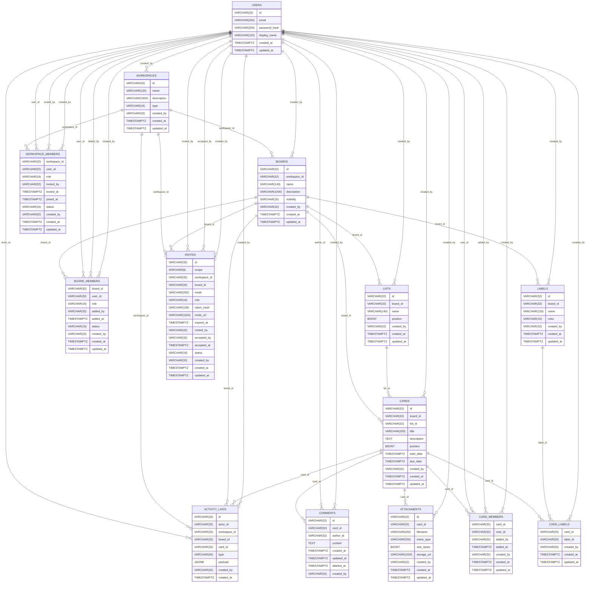

# ERD — Boardly

Boardly 데이터베이스 스키마를 기반으로 생성한 ERD입니다. 원본: `boardly-schema.md`.

## 테이블 설명

### users

* ULID prefix usr\_
* email unique (citext 또는 LOWER 함수 인덱스)
* created\_at/updated\_at TIMESTAMPTZ

### workspaces

* type: PERSONAL|TEAM
* unique (created\_by, name)

### boards

* visibility: PRIVATE|WORKSPACE|PUBLIC
* unique (workspace\_id, name)

### lists

* board 내 정렬용 position 컬럼 보유

### cards

* position unique per list (list\_id, position)
* due\_date 인덱스 권장

### workspace\_members

* role: ADMIN|MEMBER
* status: ACTIVE|INVITED|REMOVED
* PK(workspace\_id, user\_id)

### board\_members

* role: ADMIN|MEMBER|VIEWER
* PK(board\_id, user\_id)

### labels

* unique (board\_id, name)

### card\_labels

* PK(card\_id, label\_id)

### card\_members

* PK(card\_id, user\_id)

### comments

* 소프트 삭제(deleted\_at) 지원, 최신순 인덱스 예시 제공

### attachments

* size\_bytes >= 0 제약

### activity\_logs

* payload JSONB + GIN 인덱스 권장

### invites

* scope: WORKSPACE|BOARD (scope-target 일관성 체크)
* role 허용값은 scope별로 상이
* status: PENDING|ACCEPTED|DECLINED|EXPIRED
* PENDING 초대 partial unique 인덱스 예시

## 참고/제약 요약

* 모든 PK는 ULID prefix가 포함된 VARCHAR(32) (예: usr\_, wsp\_, brd\_, crd\_ 등).
* 시간 컬럼은 TIMESTAMPTZ 표준 사용 (PostgreSQL 기준).
* 선택적 PostgreSQL 최적화: citext, pg\_trgm, JSONB + GIN, partial unique indexes.
