# Boardly ERD 다이어그램

## 개요
Boardly 프로젝트의 데이터베이스 테이블 구조와 관계를 정의합니다.

## ERD 다이어그램

```mermaid
erDiagram
%% ==========================================================
%% ===============  TABLES + COLUMNS (ERD)  =================
%% ==========================================================
%% 표기 규칙
%% - PK, FK, UQ, NN(=NOT NULL), NULL(허용), DEF(기본값), ENUM(허용값)
%% - PG전용 JSON은 공용 TEXT로 표기(활용 시 PG에서 JSON/JSONB로 변경 가능)

    USERS {
        VARCHAR id PK "usr_+ULID, PK"
        VARCHAR email "UQ, NN"
        VARCHAR username "UQ, NN"
        VARCHAR password_hash "NN"
        VARCHAR display_name "NULL"
        TIMESTAMP created_at "NN, DEF now()"
        TIMESTAMP updated_at "NN, DEF now()"
    }

    WORKSPACES {
        VARCHAR id PK "wks_+ULID, PK"
        VARCHAR name "NN"
        VARCHAR description "NULL"
        VARCHAR type "NN, ENUM: PERSONAL|TEAM"
        VARCHAR created_by FK "→ USERS.id, NN"
        TIMESTAMP created_at "NN, DEF now()"
        TIMESTAMP updated_at "NN, DEF now()"
    }

    BOARDS {
        VARCHAR id PK "brd_+ULID, PK"
        VARCHAR workspace_id FK "→ WORKSPACES.id, NN, ON DELETE CASCADE"
        VARCHAR name "NN"
        VARCHAR description "NULL"
        VARCHAR visibility "NN, ENUM: PRIVATE|WORKSPACE|PUBLIC"
        VARCHAR created_by FK "→ USERS.id, NN"
        TIMESTAMP created_at "NN, DEF now()"
        TIMESTAMP updated_at "NN, DEF now()"
    }

    LISTS {
        VARCHAR id PK "lst_+ULID, PK"
        VARCHAR board_id FK "→ BOARDS.id, NN, ON DELETE CASCADE"
        VARCHAR name "NN"
        BIGINT  position "NN, 정렬 키"
        VARCHAR created_by FK "→ USERS.id, NN"
        TIMESTAMP created_at "NN, DEF now()"
        TIMESTAMP updated_at "NN, DEF now()"
        TIMESTAMP archived_at "NULL"
    }

    CARDS {
        VARCHAR id PK "crd_+ULID, PK"
        VARCHAR board_id FK "→ BOARDS.id, NN, ON DELETE CASCADE"
        VARCHAR list_id  FK "→ LISTS.id,  NN, ON DELETE CASCADE"
        VARCHAR title "NN"
        TEXT    description "NULL"
        BIGINT  position "NN, 리스트 내 정렬"
        TIMESTAMP start_date "NULL"
        TIMESTAMP due_date "NULL"
        VARCHAR created_by FK "→ USERS.id, NN"
        TIMESTAMP created_at "NN, DEF now()"
        TIMESTAMP updated_at "NN, DEF now()"
        TIMESTAMP archived_at "NULL"
    }

    WORKSPACE_MEMBERS {
        VARCHAR workspace_id PK, FK "PK part, → WORKSPACES.id, ON DELETE CASCADE"
        VARCHAR user_id      PK, FK "PK part, → USERS.id,      ON DELETE CASCADE"
        VARCHAR role "NN, ENUM: ADMIN|MEMBER"
        VARCHAR invited_by FK "→ USERS.id, NULL"
        TIMESTAMP invited_at "NULL"
        TIMESTAMP joined_at  "NULL"
        VARCHAR status "NN, DEF 'ACTIVE', ENUM: ACTIVE|INVITED|REMOVED"
        VARCHAR created_by FK "→ USERS.id, NN"
        TIMESTAMP created_at "NN, DEF now()"
        TIMESTAMP updated_at "NN, DEF now()"
        %% UNIQUE (workspace_id, user_id) 는 합성 PK로 충족
    }

    BOARD_MEMBERS {
        VARCHAR board_id PK, FK "PK part, → BOARDS.id, ON DELETE CASCADE"
        VARCHAR user_id  PK, FK "PK part, → USERS.id,  ON DELETE CASCADE"
        VARCHAR role "NN, ENUM: ADMIN|MEMBER|VIEWER"
        VARCHAR status "NN, DEF 'ACTIVE'"
        VARCHAR added_by FK "→ USERS.id, NULL"
        TIMESTAMP added_at "NULL"
        BOOLEAN is_favorite "NN, DEF FALSE"
        TIMESTAMP favorite_at "NULL"
        TIMESTAMP last_access_at "NULL, 사용자별 해당 보드 마지막 접속"
        VARCHAR created_by FK "→ USERS.id, NN"
        TIMESTAMP created_at "NN, DEF now()"
        TIMESTAMP updated_at "NN, DEF now()"
        %% UNIQUE (board_id, user_id) 는 합성 PK로 충족
        %% 정렬 인덱스 예: (user_id, is_favorite, last_access_at)
    }

    LABELS {
        VARCHAR id PK "lbl_+ULID, PK"
        VARCHAR board_id FK "→ BOARDS.id, NN, ON DELETE CASCADE"
        VARCHAR name "NN, 보드 내 UQ"
        VARCHAR color "NULL"
        VARCHAR created_by FK "→ USERS.id, NN"
        TIMESTAMP created_at "NN, DEF now()"
        TIMESTAMP updated_at "NN, DEF now()"
        %% UNIQUE (board_id, name)
    }

    CARD_LABELS {
        VARCHAR card_id  PK, FK "PK part, → CARDS.id,  ON DELETE CASCADE"
        VARCHAR label_id PK, FK "PK part, → LABELS.id, ON DELETE CASCADE"
        VARCHAR created_by FK "→ USERS.id, NN"
        TIMESTAMP created_at "NN, DEF now()"
        TIMESTAMP updated_at "NN, DEF now()"
        %% UNIQUE (card_id, label_id) 는 합성 PK로 충족
    }

    CARD_MEMBERS {
        VARCHAR card_id PK, FK "PK part, → CARDS.id, ON DELETE CASCADE"
        VARCHAR user_id PK, FK "PK part, → USERS.id, ON DELETE CASCADE"
        VARCHAR added_by FK "→ USERS.id, NULL"
        TIMESTAMP added_at "NULL"
        VARCHAR created_by FK "→ USERS.id, NN"
        TIMESTAMP created_at "NN, DEF now()"
        TIMESTAMP updated_at "NN, DEF now()"
        %% UNIQUE (card_id, user_id) 는 합성 PK로 충족
    }

    COMMENTS {
        VARCHAR id PK "cmt_+ULID, PK"
        VARCHAR card_id  FK "→ CARDS.id, NN, ON DELETE CASCADE"
        VARCHAR author_id FK "→ USERS.id, NN"
        TEXT    body "NN"
        VARCHAR created_by FK "→ USERS.id, NN (보통 author_id)"
        TIMESTAMP created_at "NN, DEF now()"
        TIMESTAMP updated_at "NN, DEF now()"
        TIMESTAMP deleted_at "NULL (soft delete)"
    }

    ATTACHMENTS {
        VARCHAR id PK "att_+ULID, PK"
        VARCHAR card_id FK "→ CARDS.id, NN, ON DELETE CASCADE"
        VARCHAR filename "NN"
        VARCHAR mime_type "NULL"
        BIGINT  size_bytes "NULL"
        VARCHAR storage_url "NN"
        VARCHAR created_by FK "→ USERS.id, NN"
        TIMESTAMP created_at "NN, DEF now()"
        TIMESTAMP updated_at "NN, DEF now()"
    }

    ACTIVITY_LOGS {
        VARCHAR id PK "act_+ULID, PK"
        VARCHAR actor_id FK "→ USERS.id, NN"
        VARCHAR workspace_id FK "→ WORKSPACES.id, NULL, ON DELETE CASCADE"
        VARCHAR board_id     FK "→ BOARDS.id,     NULL, ON DELETE CASCADE"
        VARCHAR card_id      FK "→ CARDS.id,      NULL, ON DELETE CASCADE"
        VARCHAR type "NN, 예: CARD_MOVED/LIST_CREATED 등"
        TEXT    payload "NULL, 공용 TEXT(※ PG에선 JSON/JSONB로 변경 가능)"
        VARCHAR created_by FK "→ USERS.id, NN (보통 actor_id)"
        TIMESTAMP created_at "NN, DEF now()"
    }

    INVITES {
        VARCHAR id PK "inv_+ULID, PK"
        VARCHAR scope "NN, ENUM: WORKSPACE|BOARD"
        VARCHAR workspace_id FK "→ WORKSPACES.id, NULL, ON DELETE CASCADE"
        VARCHAR board_id     FK "→ BOARDS.id,     NULL, ON DELETE CASCADE"
        VARCHAR email "NN"
        VARCHAR role  "NN, scope별 제한"
        VARCHAR token "NN, UQ (저장시 해시 권장)"
        VARCHAR invite_url "NN"
        TIMESTAMP expires_at "NN (기본값은 앱에서 now+7d 설정 권장)"
        VARCHAR invited_by  FK "→ USERS.id, NN"
        VARCHAR accepted_by FK "→ USERS.id, NULL"
        TIMESTAMP accepted_at "NULL"
        VARCHAR status "NN, ENUM: PENDING|ACCEPTED|DECLINED|EXPIRED"
        VARCHAR created_by FK "→ USERS.id, NN"
        TIMESTAMP created_at "NN, DEF now()"
        TIMESTAMP updated_at "NN, DEF now()"
        %% CHECK:
        %%  scope=WORKSPACE -> workspace_id 필수, role ∈ {ADMIN,MEMBER}
        %%  scope=BOARD     -> board_id     필수, role ∈ {ADMIN,MEMBER,VIEWER}
    }

%% ==========================================================
%% =====================  RELATIONSHIPS  ====================
%% ==========================================================

    USERS ||--o{ WORKSPACES : "creates"
    WORKSPACES ||--o{ BOARDS : "has"
    BOARDS ||--o{ LISTS : "has"
    LISTS ||--o{ CARDS : "has"

    USERS ||--o{ WORKSPACE_MEMBERS : "joins"
    WORKSPACES ||--o{ WORKSPACE_MEMBERS : "has"

    USERS ||--o{ BOARD_MEMBERS : "joins"
    BOARDS ||--o{ BOARD_MEMBERS : "has"

    BOARDS ||--o{ LABELS : "has"
    CARDS ||--o{ CARD_LABELS : "tagged"
    LABELS ||--o{ CARD_LABELS : "for"

    CARDS ||--o{ CARD_MEMBERS : "assigned"
    USERS ||--o{ CARD_MEMBERS : "joins"

    CARDS ||--o{ COMMENTS : "has"
    USERS ||--o{ COMMENTS : "writes"

    CARDS ||--o{ ATTACHMENTS : "has"
    USERS ||--o{ ATTACHMENTS : "uploads"

    USERS ||--o{ ACTIVITY_LOGS : "acts"
    WORKSPACES ||--o{ ACTIVITY_LOGS : "context"
    BOARDS ||--o{ ACTIVITY_LOGS : "context"
    CARDS ||--o{ ACTIVITY_LOGS : "context"

    WORKSPACES ||--o{ INVITES : "issues"
    BOARDS ||--o{ INVITES : "issues"
    USERS ||--o{ INVITES : "sends"
```



## 주요 개선사항

### 1. 합성키 사용으로 성능 최적화
- **workspace_memberships**: (user_id, workspace_id) 합성키
- **board_members**: (user_id, board_id) 합성키  
- **board_favorites**: (user_id, board_id) 합성키
- **card_assignees**: (card_id, user_id) 합성키
- **card_labels**: (card_id, label_id) 합성키

### 2. 초대자/작업자 추적 기능 추가
- **workspace_memberships.invited_by**: 워크스페이스 초대자 추적
- **board_members.invited_by**: 보드 초대자 추적
- **card_assignees.assigned_by**: 카드 담당자 할당자 추적
- **card_labels.applied_by**: 라벨 적용자 추적

### 3. 데이터 무결성 강화
- **자연스러운 키**: 비즈니스적으로 의미 있는 합성키 사용
- **중복 방지**: 합성키로 중복 데이터 방지
- **감사 추적**: 모든 작업의 주체 추적 가능

### 4. 성능 최적화
- **저장 공간 절약**: 불필요한 id 필드 제거
- **인덱스 효율성**: 합성키로 인덱스 최적화
- **쿼리 성능**: 조인 성능 향상

## 테이블 구조 상세

### 1. users (사용자)
```sql
CREATE TABLE users (
  id             VARCHAR PRIMARY KEY,
  email          VARCHAR NOT NULL UNIQUE,
  username       VARCHAR NOT NULL UNIQUE,
  password_hash  VARCHAR NOT NULL,
  display_name   VARCHAR,
  created_at     TIMESTAMP NOT NULL DEFAULT CURRENT_TIMESTAMP,
  updated_at     TIMESTAMP NOT NULL DEFAULT CURRENT_TIMESTAMP
);
```

### 2. workspaces (워크스페이스)
```sql
CREATE TABLE workspaces (
  id             VARCHAR PRIMARY KEY,
  name           VARCHAR NOT NULL,
  description    VARCHAR,
  type           VARCHAR NOT NULL, -- PERSONAL | TEAM
  created_by     VARCHAR NOT NULL REFERENCES users(id),
  created_at     TIMESTAMP NOT NULL DEFAULT CURRENT_TIMESTAMP,
  updated_at     TIMESTAMP NOT NULL DEFAULT CURRENT_TIMESTAMP
);
```

### 3. workspace_members (워크스페이스 멤버)
```sql
CREATE TABLE workspace_members (
  workspace_id   VARCHAR NOT NULL REFERENCES workspaces(id) ON DELETE CASCADE,
  user_id        VARCHAR NOT NULL REFERENCES users(id) ON DELETE CASCADE,
  role           VARCHAR NOT NULL, -- ADMIN | MEMBER
  invited_by     VARCHAR REFERENCES users(id),
  invited_at     TIMESTAMP,
  joined_at      TIMESTAMP,
  status         VARCHAR NOT NULL DEFAULT 'ACTIVE',
  created_by     VARCHAR NOT NULL REFERENCES users(id),
  created_at     TIMESTAMP NOT NULL DEFAULT CURRENT_TIMESTAMP,
  updated_at     TIMESTAMP NOT NULL DEFAULT CURRENT_TIMESTAMP,
  PRIMARY KEY (workspace_id, user_id)
);
```

### 4. boards (보드)
```sql
CREATE TABLE boards (
  id             VARCHAR PRIMARY KEY,
  workspace_id   VARCHAR NOT NULL REFERENCES workspaces(id) ON DELETE CASCADE,
  name           VARCHAR NOT NULL,
  description    VARCHAR,
  visibility     VARCHAR NOT NULL, -- PRIVATE | WORKSPACE | PUBLIC
  created_by     VARCHAR NOT NULL REFERENCES users(id),
  created_at     TIMESTAMP NOT NULL DEFAULT CURRENT_TIMESTAMP,
  updated_at     TIMESTAMP NOT NULL DEFAULT CURRENT_TIMESTAMP
);
```

### 5. board_members (보드 멤버)
```sql
CREATE TABLE board_members (
  board_id       VARCHAR NOT NULL REFERENCES boards(id) ON DELETE CASCADE,
  user_id        VARCHAR NOT NULL REFERENCES users(id) ON DELETE CASCADE,
  role           VARCHAR NOT NULL CHECK (role IN ('ADMIN','MEMBER','VIEWER')),
  status         VARCHAR NOT NULL DEFAULT 'ACTIVE',
  added_by       VARCHAR REFERENCES users(id),
  added_at       TIMESTAMP,
  is_favorite    BOOLEAN NOT NULL DEFAULT FALSE,
  favorite_at    TIMESTAMP,
  last_access_at TIMESTAMP,
  created_by     VARCHAR NOT NULL REFERENCES users(id),
  created_at     TIMESTAMP NOT NULL DEFAULT CURRENT_TIMESTAMP,
  updated_at     TIMESTAMP NOT NULL DEFAULT CURRENT_TIMESTAMP,
  PRIMARY KEY (board_id, user_id)
);
```

### 6. lists (리스트)
```sql
CREATE TABLE lists (
  id             VARCHAR PRIMARY KEY,
  board_id       VARCHAR NOT NULL REFERENCES boards(id) ON DELETE CASCADE,
  name           VARCHAR NOT NULL,
  position       BIGINT NOT NULL,
  created_by     VARCHAR NOT NULL REFERENCES users(id),
  created_at     TIMESTAMP NOT NULL DEFAULT CURRENT_TIMESTAMP,
  updated_at     TIMESTAMP NOT NULL DEFAULT CURRENT_TIMESTAMP,
  archived_at    TIMESTAMP
);
```

### 7. cards (카드)
```sql
CREATE TABLE cards (
  id             VARCHAR PRIMARY KEY,
  board_id       VARCHAR NOT NULL REFERENCES boards(id) ON DELETE CASCADE,
  list_id        VARCHAR NOT NULL REFERENCES lists(id) ON DELETE CASCADE,
  title          VARCHAR NOT NULL,
  description    TEXT,
  position       BIGINT NOT NULL,
  start_date     TIMESTAMP,
  due_date       TIMESTAMP,
  created_by     VARCHAR NOT NULL REFERENCES users(id),
  created_at     TIMESTAMP NOT NULL DEFAULT CURRENT_TIMESTAMP,
  updated_at     TIMESTAMP NOT NULL DEFAULT CURRENT_TIMESTAMP,
  archived_at    TIMESTAMP
);
```

### 8. card_members (카드 담당자)
```sql
CREATE TABLE card_members (
  card_id        VARCHAR NOT NULL REFERENCES cards(id) ON DELETE CASCADE,
  user_id        VARCHAR NOT NULL REFERENCES users(id) ON DELETE CASCADE,
  added_by       VARCHAR REFERENCES users(id),
  added_at       TIMESTAMP,
  created_by     VARCHAR NOT NULL REFERENCES users(id),
  created_at     TIMESTAMP NOT NULL DEFAULT CURRENT_TIMESTAMP,
  updated_at     TIMESTAMP NOT NULL DEFAULT CURRENT_TIMESTAMP,
  PRIMARY KEY (card_id, user_id)
);
```

### 9. comments (댓글)
```sql
CREATE TABLE comments (
  id             VARCHAR PRIMARY KEY,
  card_id        VARCHAR NOT NULL REFERENCES cards(id) ON DELETE CASCADE,
  author_id      VARCHAR NOT NULL REFERENCES users(id),
  body           TEXT NOT NULL,
  created_by     VARCHAR NOT NULL REFERENCES users(id),
  created_at     TIMESTAMP NOT NULL DEFAULT CURRENT_TIMESTAMP,
  updated_at     TIMESTAMP NOT NULL DEFAULT CURRENT_TIMESTAMP,
  deleted_at     TIMESTAMP
);
```

### 10. labels (라벨)
```sql
CREATE TABLE labels (
  id             VARCHAR PRIMARY KEY,
  board_id       VARCHAR NOT NULL REFERENCES boards(id) ON DELETE CASCADE,
  name           VARCHAR NOT NULL,
  color          VARCHAR,
  created_by     VARCHAR NOT NULL REFERENCES users(id),
  created_at     TIMESTAMP NOT NULL DEFAULT CURRENT_TIMESTAMP,
  updated_at     TIMESTAMP NOT NULL DEFAULT CURRENT_TIMESTAMP,
  UNIQUE (board_id, name)
);
```

### 11. card_labels (카드 라벨)
```sql
CREATE TABLE card_labels (
  card_id        VARCHAR NOT NULL REFERENCES cards(id) ON DELETE CASCADE,
  label_id       VARCHAR NOT NULL REFERENCES labels(id) ON DELETE CASCADE,
  created_by     VARCHAR NOT NULL REFERENCES users(id),
  created_at     TIMESTAMP NOT NULL DEFAULT CURRENT_TIMESTAMP,
  updated_at     TIMESTAMP NOT NULL DEFAULT CURRENT_TIMESTAMP,
  PRIMARY KEY (card_id, label_id)
);
```


### 12. invites (워크스페이스/보드 초대)
```sql
CREATE TABLE invites (
  id             VARCHAR PRIMARY KEY,
  scope          VARCHAR NOT NULL, -- WORKSPACE | BOARD
  workspace_id   VARCHAR REFERENCES workspaces(id) ON DELETE CASCADE,
  board_id       VARCHAR REFERENCES boards(id) ON DELETE CASCADE,
  email          VARCHAR NOT NULL,
  role           VARCHAR NOT NULL,
  token          VARCHAR NOT NULL UNIQUE,
  invite_url     VARCHAR NOT NULL,
  expires_at     TIMESTAMP NOT NULL, -- 앱에서 now+7d 세팅
  invited_by     VARCHAR NOT NULL REFERENCES users(id),
  accepted_by    VARCHAR REFERENCES users(id),
  accepted_at    TIMESTAMP,
  status         VARCHAR NOT NULL CHECK (status IN ('PENDING','ACCEPTED','DECLINED','EXPIRED')),
  created_by     VARCHAR NOT NULL REFERENCES users(id),
  created_at     TIMESTAMP NOT NULL DEFAULT CURRENT_TIMESTAMP,
  updated_at     TIMESTAMP NOT NULL DEFAULT CURRENT_TIMESTAMP,
  CHECK (
    (scope = 'WORKSPACE' AND workspace_id IS NOT NULL AND board_id IS NULL AND role IN ('ADMIN','MEMBER')) OR
    (scope = 'BOARD'     AND board_id     IS NOT NULL AND workspace_id IS NULL AND role IN ('ADMIN','MEMBER','VIEWER'))
  )
);
```

### 13. activity_logs (활동 로그)
```sql
CREATE TABLE activity_logs (
  id             VARCHAR PRIMARY KEY,
  actor_id       VARCHAR NOT NULL REFERENCES users(id),
  workspace_id   VARCHAR REFERENCES workspaces(id) ON DELETE CASCADE,
  board_id       VARCHAR REFERENCES boards(id) ON DELETE CASCADE,
  card_id        VARCHAR REFERENCES cards(id) ON DELETE CASCADE,
  type           VARCHAR NOT NULL,
  payload        TEXT, -- H2 호환 위해 TEXT (PG에서는 JSON/JSONB로 변경 가능)
  created_by     VARCHAR NOT NULL REFERENCES users(id),
  created_at     TIMESTAMP NOT NULL DEFAULT CURRENT_TIMESTAMP
);
```

### 14. attachments (첨부 파일)
```sql
CREATE TABLE attachments (
  id             VARCHAR PRIMARY KEY,
  card_id        VARCHAR NOT NULL REFERENCES cards(id) ON DELETE CASCADE,
  filename       VARCHAR NOT NULL,
  mime_type      VARCHAR,
  size_bytes     BIGINT,
  storage_url    VARCHAR NOT NULL,
  created_by     VARCHAR NOT NULL REFERENCES users(id),
  created_at     TIMESTAMP NOT NULL DEFAULT CURRENT_TIMESTAMP,
  updated_at     TIMESTAMP NOT NULL DEFAULT CURRENT_TIMESTAMP
);
```

## 인덱스 설계

### 주요 인덱스
```sql
----------------------------------------------------------------------
-- users
----------------------------------------------------------------------

-- 이메일 중복 방지 및 로그인/조회 최적화 (이미 UNIQUE 제약이 있어도 명시적 이름 부여)
CREATE UNIQUE INDEX IF NOT EXISTS uq_users_email
  ON users (email);

-- username 중복 방지 및 로그인/조회 최적화
CREATE UNIQUE INDEX IF NOT EXISTS uq_users_username
  ON users (username);


----------------------------------------------------------------------
-- workspaces
----------------------------------------------------------------------

-- 사용자별 내가 만든 워크스페이스 목록 조회 최적화
CREATE INDEX IF NOT EXISTS idx_workspaces_created_by
  ON workspaces (created_by);

-- 팀/개인 타입 구분 조회(관리 화면 등 필터링)
CREATE INDEX IF NOT EXISTS idx_workspaces_type
  ON workspaces (type);


----------------------------------------------------------------------
-- boards
----------------------------------------------------------------------

-- 특정 워크스페이스의 보드 목록 조회 최적화
CREATE INDEX IF NOT EXISTS idx_boards_workspace
  ON boards (workspace_id);

-- 보드 공개 범위(가시성)로 필터링 조회
CREATE INDEX IF NOT EXISTS idx_boards_visibility
  ON boards (visibility);

-- 생성자 기준 보드 조회(내가 만든 보드 등)
CREATE INDEX IF NOT EXISTS idx_boards_created_by
  ON boards (created_by);


----------------------------------------------------------------------
-- lists
----------------------------------------------------------------------

-- 보드 내 리스트 정렬(position) 조회 최적화
CREATE INDEX IF NOT EXISTS idx_lists_board_position
  ON lists (board_id, position);

-- 리스트 생성자 기준 조회(감사/관리성 질의)
CREATE INDEX IF NOT EXISTS idx_lists_created_by
  ON lists (created_by);


----------------------------------------------------------------------
-- cards
----------------------------------------------------------------------

-- 리스트 내 카드 정렬(position) + 페이지네이션 조회 최적화
CREATE INDEX IF NOT EXISTS idx_cards_list_position
  ON cards (list_id, position);

-- 보드 단위 카드 집계/검색(라벨/멤버 조인 전에 보드 범위로 빠르게 좁히기)
CREATE INDEX IF NOT EXISTS idx_cards_board
  ON cards (board_id);

-- 마감일(캘린더/알림/오버듀 조회) 최적화
CREATE INDEX IF NOT EXISTS idx_cards_due_date
  ON cards (due_date);

-- 카드 생성자 기준 조회(감사/마이 작업 등)
CREATE INDEX IF NOT EXISTS idx_cards_created_by
  ON cards (created_by);


----------------------------------------------------------------------
-- workspace_members (합성 PK: workspace_id, user_id)
----------------------------------------------------------------------

-- 특정 사용자가 속한 워크스페이스 목록(사이드바/드롭다운 등) 최적화
CREATE INDEX IF NOT EXISTS idx_workspace_members_user
  ON workspace_members (user_id);

-- 워크스페이스 내 역할별 멤버 조회(관리자 화면) 최적화
CREATE INDEX IF NOT EXISTS idx_workspace_members_workspace_role
  ON workspace_members (workspace_id, role);

-- 초대/가입 상태로 필터링(감사/운영)
CREATE INDEX IF NOT EXISTS idx_workspace_members_status
  ON workspace_members (status);


----------------------------------------------------------------------
-- board_members (합성 PK: board_id, user_id)
----------------------------------------------------------------------

-- 사용자 관점 보드 리스트 정렬: 즐겨찾기 먼저, 그 다음 최근 접속 순
-- * H2/PG 공용을 위해 DESC/NULLS LAST를 인덱스에 넣지 않고, ORDER BY에서 처리
CREATE INDEX IF NOT EXISTS idx_board_members_user_sort
  ON board_members (user_id, is_favorite, last_access_at);

-- 보드 관점 멤버 리스트/권한 관리 화면
CREATE INDEX IF NOT EXISTS idx_board_members_board
  ON board_members (board_id);

-- 역할별 멤버 필터(관리자/뷰어만 보기 등)
CREATE INDEX IF NOT EXISTS idx_board_members_role
  ON board_members (role);

-- 멤버십 상태(탈퇴/초대/활성) 필터
CREATE INDEX IF NOT EXISTS idx_board_members_status
  ON board_members (status);


----------------------------------------------------------------------
-- labels
----------------------------------------------------------------------

-- 보드별 라벨 목록 조회 최적화
CREATE INDEX IF NOT EXISTS idx_labels_board
  ON labels (board_id);

-- (board_id, name) UNIQUE 제약이 이미 존재하지만, 일부 엔진에서
-- 명시 이름을 부여하고 싶다면 UNIQUE INDEX로 별도 네이밍 가능
-- CREATE UNIQUE INDEX IF NOT EXISTS uq_labels_board_name ON labels (board_id, name);


----------------------------------------------------------------------
-- card_labels (합성 PK: card_id, label_id)
----------------------------------------------------------------------

-- 카드 기준 라벨 조인 최적화(카드 상세/검색)
CREATE INDEX IF NOT EXISTS idx_card_labels_card
  ON card_labels (card_id);

-- 라벨 기준 카드 조회(라벨 필터 검색)
CREATE INDEX IF NOT EXISTS idx_card_labels_label
  ON card_labels (label_id);


----------------------------------------------------------------------
-- card_members (합성 PK: card_id, user_id)
----------------------------------------------------------------------

-- 사용자 기준 내가 담당인 카드 조회(마이 작업)
CREATE INDEX IF NOT EXISTS idx_card_members_user
  ON card_members (user_id);

-- 카드 기준 담당자 목록(카드 상세)
CREATE INDEX IF NOT EXISTS idx_card_members_card
  ON card_members (card_id);


----------------------------------------------------------------------
-- comments
----------------------------------------------------------------------

-- 카드 상세 화면에서 댓글 목록 시간 순 조회
CREATE INDEX IF NOT EXISTS idx_comments_card_created
  ON comments (card_id, created_at);

-- 사용자(작성자) 기준 내 댓글/활동 조회
CREATE INDEX IF NOT EXISTS idx_comments_author
  ON comments (author_id);


----------------------------------------------------------------------
-- attachments
----------------------------------------------------------------------

-- 카드 상세에서 첨부 파일 목록 조회
CREATE INDEX IF NOT EXISTS idx_attachments_card
  ON attachments (card_id);

-- 생성자 기준 첨부 파일 감사/검색
CREATE INDEX IF NOT EXISTS idx_attachments_created_by
  ON attachments (created_by);


----------------------------------------------------------------------
-- activity_logs
----------------------------------------------------------------------

-- 보드 타임라인(활동 로그) 조회 최적화
CREATE INDEX IF NOT EXISTS idx_activity_logs_board_time
  ON activity_logs (board_id, created_at);

-- 카드 타임라인(활동 로그) 조회 최적화
CREATE INDEX IF NOT EXISTS idx_activity_logs_card_time
  ON activity_logs (card_id, created_at);

-- 사용자 활동 이력 조회 최적화
CREATE INDEX IF NOT EXISTS idx_activity_logs_actor_time
  ON activity_logs (actor_id, created_at);


----------------------------------------------------------------------
-- invites
----------------------------------------------------------------------

-- 워크스페이스 초대 조회(운영/감사): scope + workspace_id
CREATE INDEX IF NOT EXISTS idx_invites_workspace
  ON invites (scope, workspace_id);

-- 보드 초대 조회(운영/감사): scope + board_id
CREATE INDEX IF NOT EXISTS idx_invites_board
  ON invites (scope, board_id);

-- 초대 상태(PENDING/ACCEPTED/DECLINED/EXPIRED) 필터
CREATE INDEX IF NOT EXISTS idx_invites_status
  ON invites (status);

-- 만료일 기반 청소/모니터링(배치)
CREATE INDEX IF NOT EXISTS idx_invites_expires
  ON invites (expires_at);

-- 초대 메일 재발송/조회 시 이메일 키로 빠르게 찾기(옵션)
CREATE INDEX IF NOT EXISTS idx_invites_email
  ON invites (email);
```

## 제약사항

### 비즈니스 규칙 제약사항
1. **워크스페이스 생성자 제약**: 워크스페이스 생성자는 반드시 해당 워크스페이스의 ADMIN 멤버로 자동 등록됨
2. **보드 생성자 제약**: 보드 생성자는 반드시 해당 워크스페이스의 멤버여야 함
3. **개인 워크스페이스 제약**: PERSONAL 타입 워크스페이스는 사용자당 1개만 생성 가능
4. **워크스페이스 이름 제약**: 동일한 사용자는 같은 워크스페이스 이름을 가질 수 없음
5. **보드 멤버 제약**: 보드 멤버는 반드시 해당 워크스페이스의 멤버여야 함 (외부 초대 제외)
6. **초대자 제약**: invited_by는 반드시 해당 워크스페이스/보드의 멤버여야 함
7. **라벨 이름 제약**: 동일한 보드 내에서 라벨 이름은 고유해야 함
8. **초대 범위 제약**: 
   - WORKSPACE 초대: role은 ADMIN 또는 MEMBER만 가능
   - BOARD 초대: role은 ADMIN, MEMBER, VIEWER만 가능
9. **활동 로그 제약**: actor_id와 created_by는 보통 동일한 값이어야 함

### 데이터 무결성 제약사항
1. **CASCADE 삭제**: 
   - 워크스페이스 삭제 시 관련 보드, 멤버, 초대, 활동 로그 자동 삭제
   - 보드 삭제 시 관련 리스트, 카드, 멤버, 라벨, 초대, 활동 로그 자동 삭제
   - 리스트 삭제 시 관련 카드 자동 삭제
   - 카드 삭제 시 관련 담당자, 라벨, 댓글, 첨부파일, 활동 로그 자동 삭제
2. **RESTRICT 삭제**: 사용자 삭제 시 생성한 워크스페이스/보드가 있으면 삭제 제한
3. **UNIQUE 제약**: 
   - users.email, users.username
   - workspace_members (workspace_id, user_id)
   - board_members (board_id, user_id)
   - card_members (card_id, user_id)
   - card_labels (card_id, label_id)
   - labels (board_id, name)
   - invites.token
4. **NOT NULL 제약**: 필수 필드에 대한 NULL 값 방지
5. **권한 상속**: 워크스페이스 ADMIN은 해당 워크스페이스의 모든 보드에 ADMIN 권한 자동 부여
6. **합성키 제약**: 중간 테이블의 합성키로 중복 데이터 방지
7. **체크 제약**: 
   - workspace_members.role: ADMIN, MEMBER만 허용
   - board_members.role: ADMIN, MEMBER, VIEWER만 허용
   - invites.status: PENDING, ACCEPTED, DECLINED, EXPIRED만 허용
   - invites.scope: WORKSPACE 또는 BOARD만 허용
8. **소프트 삭제**: comments.deleted_at, lists.archived_at, cards.archived_at으로 논리적 삭제 지원

## 성능 최적화 효과

### 1. 저장 공간 절약
- **workspace_members**: id 필드 제거로 약 8바이트/행 절약
- **board_members**: id 필드 제거로 약 8바이트/행 절약
- **card_members**: id 필드 제거로 약 8바이트/행 절약
- **card_labels**: id 필드 제거로 약 8바이트/행 절약
- **전체 예상 절약**: 10만 명 사용자 기준 약 2-5MB 절약

### 2. 쿼리 성능 향상
- **조인 성능**: 합성키로 인한 조인 성능 향상 (약 15-30% 성능 개선)
- **인덱스 효율성**: 불필요한 인덱스 제거로 INSERT/UPDATE 성능 향상
- **메모리 사용량**: 인덱스 크기 감소로 메모리 사용량 절약
- **정렬 성능**: board_members의 (user_id, is_favorite, last_access_at) 인덱스로 사용자별 보드 목록 정렬 최적화

### 3. 데이터 일관성 강화
- **중복 방지**: 합성키로 자연스러운 중복 데이터 방지
- **감사 추적**: 모든 작업의 주체 추적 가능 (created_by, invited_by, added_by 등)
- **권한 검증**: 초대자 권한 검증 가능
- **소프트 삭제**: 논리적 삭제로 데이터 복구 가능

### 4. 인덱스 최적화 효과
- **복합 인덱스**: (board_id, position) 인덱스로 리스트/카드 정렬 최적화
- **부분 인덱스**: is_favorite = TRUE인 보드만 빠르게 조회
- **범위 쿼리**: due_date 인덱스로 마감일 기반 카드 조회 최적화
- **페이지네이션**: created_at 인덱스로 시간순 정렬 및 페이지네이션 최적화

### 5. 확장성 고려사항
- **수평 확장**: ULID 사용으로 분산 환경에서 ID 충돌 방지
- **수직 확장**: 인덱스 최적화로 단일 DB 성능 향상
- **캐싱 전략**: 자주 조회되는 사용자별 보드 목록은 Redis 캐싱 가능
- **아카이빙**: activity_logs의 오래된 데이터 자동 아카이빙 지원
