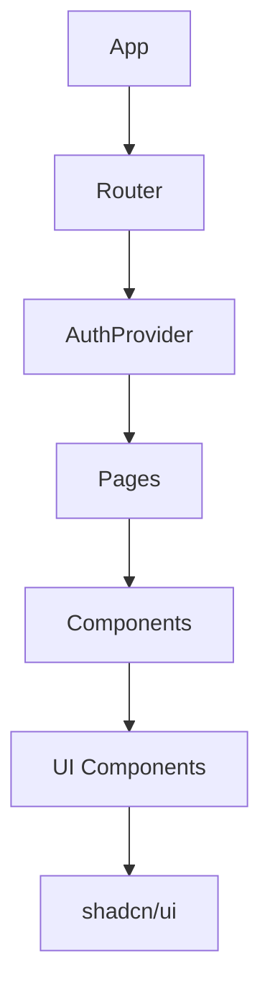
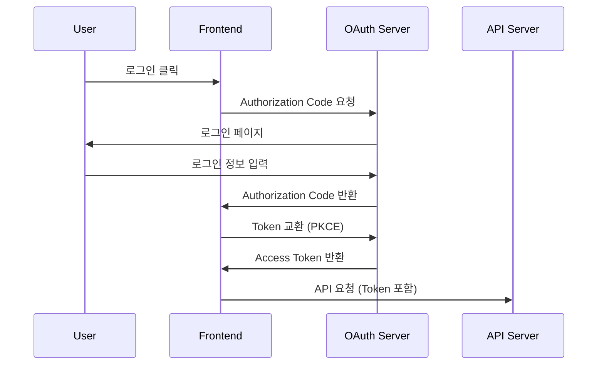

<div align="center">
  <h1>🎨 Boardly Frontend</h1>
  <p>React + TypeScript + Vite로 구축된 모던 칸반 보드 애플리케이션</p>
  
  [](https://reactjs.org/)
  [](https://www.typescriptlang.org/)
  [](https://vitejs.dev/)
  [](https://tailwindcss.com/)
  [](https://ui.shadcn.com/)
</div>

## 📋 목차

- [프로젝트 개요](#-프로젝트-개요)
- [기술 스택](#-기술-스택)
- [프로젝트 구조](#-프로젝트-구조)
- [빠른 시작](#-빠른-시작)
- [환경 설정](#-환경-설정)
- [개발 가이드](#-개발-가이드)
- [테스팅](#-테스팅)
- [빌드 및 배포](#-빌드-및-배포)
- [주요 기능](#-주요-기능)
- [아키텍처](#-아키텍처)

## 🎯 프로젝트 개요

Boardly Frontend는 React 18과 TypeScript를 기반으로 한 모던 웹 애플리케이션입니다. 직관적인 드래그 앤 드롭 인터페이스와 반응형 디자인으로 최적의 사용자 경험을 제공합니다.

### 주요 특징
- **모던 기술 스택**: React 18, TypeScript 5.x, Vite 7
- **디자인 시스템**: shadcn/ui + Tailwind CSS 4
- **반응형 디자인**: 모바일/태블릿/데스크톱 완벽 지원
- **타입 안전성**: 완전한 TypeScript 지원
- **성능 최적화**: Vite 기반 빠른 빌드 및 HMR
- **접근성**: WCAG 가이드라인 준수

## 🛠 기술 스택

### Core Technologies
| 기술 | 버전 | 용도 |
|------|------|------|
| **React** | 18.x | UI 라이브러리 |
| **TypeScript** | 5.x | 타입 안전성 |
| **Vite** | 7.x | 빌드 도구 및 개발 서버 |
| **pnpm** | Latest | 패키지 매니저 |

### UI & Styling
| 기술 | 버전 | 용도 |
|------|------|------|
| **Tailwind CSS** | 4.x | CSS 프레임워크 |
| **shadcn/ui** | Latest | UI 컴포넌트 라이브러리 |
| **Lucide React** | 0.525.x | 아이콘 라이브러리 |
| **Framer Motion** | 12.x | 애니메이션 |
| **class-variance-authority** | 0.7.x | 스타일 변형 관리 |

### State Management & Forms
| 기술 | 버전 | 용도 |
|------|------|------|
| **Zustand** | 5.x | 전역 상태 관리 |
| **React Hook Form** | 7.x | 폼 관리 |
| **Zod** | 3.x | 스키마 검증 |

### Routing & Authentication
| 기술 | 버전 | 용도 |
|------|------|------|
| **React Router DOM** | 7.x | 클라이언트 라우팅 |
| **react-oidc-context** | 3.x | OAuth2 인증 |
| **oidc-client-ts** | 3.x | OIDC 클라이언트 |

### Drag & Drop & Internationalization
| 기술 | 버전 | 용도 |
|------|------|------|
| **@dnd-kit/core** | 6.x | 드래그 앤 드롭 |
| **@dnd-kit/sortable** | 10.x | 정렬 가능한 드래그 앤 드롭 |
| **react-i18next** | 15.x | 다국어 지원 |
| **i18next** | 25.x | 국제화 프레임워크 |

### Development Tools
| 기술 | 버전 | 용도 |
|------|------|------|
| **Biome** | 2.x | 린터 및 포매터 |
| **Vitest** | 3.x | 테스트 프레임워크 |
| **@testing-library/react** | 16.x | React 테스팅 |
| **oazapfts** | 6.x | OpenAPI 클라이언트 생성 |

## 📁 프로젝트 구조

```
src/
├── components/                 # React 컴포넌트
│   ├── ui/                    # shadcn/ui 기본 컴포넌트 (테스트 제외)
│   │   ├── button.tsx         # 버튼 컴포넌트
│   │   ├── card.tsx           # 카드 컴포넌트
│   │   ├── input.tsx          # 입력 컴포넌트
│   │   └── label.tsx          # 라벨 컴포넌트
│   ├── common/                # 공통 컴포넌트
│   │   ├── LoadingButton.tsx  # 로딩 상태 버튼
│   │   ├── LoadingButton.test.tsx  # LoadingButton 테스트
│   │   ├── SuccessModal.tsx   # 성공 모달
│   │   └── SuccessModal.test.tsx   # SuccessModal 테스트
│   └── layout/                # 레이아웃 컴포넌트
│       ├── Navbar.tsx         # 네비게이션
│       └── Navbar.test.tsx    # 네비게이션 테스트
│
├── hooks/                     # 커스텀 훅
│   ├── useAuth.tsx           # OAuth 인증 훅
│   └── useAuth.test.tsx      # 인증 훅 테스트
│
├── services/                  # 외부 서비스
│   └── api/                  # API 관련
│       └── client.ts         # OpenAPI 클라이언트 (자동 생성)
│
├── utils/                     # 유틸리티 함수
│   ├── logger.ts             # 로깅 유틸리티
│   └── logger.test.ts        # 로거 테스트
│
├── lib/                       # 라이브러리 설정
│   ├── utils.ts              # shadcn/ui 유틸리티 (cn 함수)
│   └── utils.test.ts         # 유틸리티 함수 테스트
│
├── App.tsx                    # 메인 앱 컴포넌트
├── main.tsx                   # 애플리케이션 진입점
├── test-setup.ts             # 테스트 환경 설정
└── vite-env.d.ts             # Vite 타입 정의

# 설정 파일들 (루트)
├── package.json              # 패키지 설정
├── vite.config.ts           # Vite 설정
├── vitest.config.ts         # Vitest 테스트 설정
├── tsconfig.json            # TypeScript 설정
├── tsconfig.app.json        # 앱용 TypeScript 설정
├── tsconfig.node.json       # Node.js용 TypeScript 설정
├── tailwind.config.js       # Tailwind CSS 설정
├── biome.json              # Biome 린터/포매터 설정
├── .gitignore              # Git 무시 파일
├── README.md               # 프론트엔드 문서 (현재 파일)
├── ARCHITECTURE.md         # 아키텍처 문서
└── TESTING.md              # 테스팅 가이드
```

## 🚀 빠른 시작

### 사전 요구사항
- **Node.js** 18 이상
- **pnpm** 최신 버전

### 1. 저장소 클론 및 의존성 설치
```bash
# 저장소 클론
git clone https://github.com/dongwonkwak/boardly.git
cd boardly/frontend

# 의존성 설치
pnpm install
```

### 2. 환경 변수 설정
```bash
# .env.development 파일 생성
cp .env.example .env.development

# 환경 변수 편집
vim .env.development
```

### 3. 개발 서버 실행
```bash
# 개발 서버 시작
pnpm dev

# 또는 로컬 환경 파일로 실행
pnpm dev:local
```

애플리케이션이 http://localhost:5173에서 실행됩니다.

## ⚙️ 환경 설정

### 환경 변수 (.env.development)

```env
# API 설정
VITE_API_URL=http://localhost:8080
VITE_API_VERSION=v1

# OAuth2 설정
VITE_OAUTH_AUTHORIZATION_ENDPOINT=http://localhost:8080/oauth2/authorization/boardly
VITE_OAUTH_CLIENT_ID=boardly-client
VITE_OAUTH_CLIENT_SECRET=your-client-secret
VITE_OAUTH_RESPONSE_TYPE=code
VITE_OAUTH_REDIRECT_URI=http://localhost:5173/callback
VITE_OAUTH_POST_LOGOUT_REDIRECT_URI=http://localhost:5173
VITE_OAUTH_SCOPE=openid profile email
VITE_OAUTH_CLIENT_AUTHENTICATION=client_secret_basic

# 개발 환경 설정
VITE_NODE_ENV=development
VITE_LOG_LEVEL=debug
```

### 프로덕션 환경 변수 (.env.production)

```env
# API 설정
VITE_API_URL=https://api.boardly.com
VITE_API_VERSION=v1

# OAuth2 설정
VITE_OAUTH_AUTHORIZATION_ENDPOINT=https://api.boardly.com/oauth2/authorization/boardly
VITE_OAUTH_CLIENT_ID=boardly-client-prod
VITE_OAUTH_REDIRECT_URI=https://boardly.com/callback
VITE_OAUTH_POST_LOGOUT_REDIRECT_URI=https://boardly.com

# 프로덕션 환경 설정
VITE_NODE_ENV=production
VITE_LOG_LEVEL=error
```

## 💻 개발 가이드

### 사용 가능한 스크립트

```bash
# 개발 서버 실행
pnpm dev                    # 개발 모드로 실행
pnpm dev:local             # 로컬 환경 파일로 실행

# 빌드
pnpm build                 # 프로덕션 빌드
pnpm build:dev             # 개발 모드 빌드

# 코드 품질
pnpm lint                  # 린트 검사 및 수정
pnpm format                # 코드 포맷팅
pnpm check                 # 종합 코드 체크

# 테스트
pnpm test                  # 테스트 실행 (watch 모드)
pnpm test:run              # 단일 테스트 실행
pnpm test:coverage         # 커버리지 포함 테스트

# API 클라이언트 생성
pnpm generate-api          # OpenAPI 스펙으로부터 클라이언트 생성

# 미리보기
pnpm preview               # 빌드된 앱 미리보기
```

### 코딩 컨벤션

#### 1. 컴포넌트 작성 규칙
```typescript
// ✅ 좋은 예
interface ButtonProps {
  variant?: 'primary' | 'secondary';
  size?: 'sm' | 'md' | 'lg';
  disabled?: boolean;
  children: React.ReactNode;
  onClick?: () => void;
}

export const Button: React.FC<ButtonProps> = ({
  variant = 'primary',
  size = 'md',
  disabled = false,
  children,
  onClick
}) => {
  return (
    <button
      className={cn(
        'rounded-md font-medium transition-colors',
        variants[variant],
        sizes[size],
        disabled && 'opacity-50 cursor-not-allowed'
      )}
      disabled={disabled}
      onClick={onClick}
    >
      {children}
    </button>
  );
};
```

#### 2. 훅 사용 규칙
```typescript
// ✅ 좋은 예
export const useAuth = () => {
  const [user, setUser] = useState<User | null>(null);
  const [isLoading, setIsLoading] = useState(true);

  const login = useCallback(async (credentials: LoginCredentials) => {
    setIsLoading(true);
    try {
      const response = await authService.login(credentials);
      setUser(response.user);
    } catch (error) {
      console.error('Login failed:', error);
      throw error;
    } finally {
      setIsLoading(false);
    }
  }, []);

  return { user, isLoading, login };
};
```

#### 3. 스타일링 규칙
```typescript
// ✅ Tailwind CSS 클래스 순서
className={cn(
  // Layout
  'flex items-center justify-between',
  // Spacing
  'px-4 py-2 gap-2',
  // Typography
  'text-sm font-medium',
  // Colors
  'bg-blue-500 text-white',
  // Effects
  'rounded-md shadow-sm',
  // States
  'hover:bg-blue-600 focus:ring-2',
  // Responsive
  'md:px-6 lg:text-base'
)}
```

## 🧪 테스팅

### 테스트 환경
- **Vitest**: 빠른 테스트 실행 환경
- **React Testing Library**: React 컴포넌트 테스팅
- **jsdom**: 브라우저 환경 시뮬레이션
- **@vitest/coverage-v8**: 코드 커버리지

### 현재 테스트 현황
- **총 테스트 파일**: 6개
- **총 테스트 케이스**: 47개
- **통과율**: 100% ✅
- **제외된 폴더**: `src/components/ui` (shadcn/ui 컴포넌트)

### 테스트 파일 구조
```
src/
├── lib/
│   └── utils.test.ts              # cn() 함수 테스트
├── utils/
│   └── logger.test.ts             # 로거 설정 테스트
├── hooks/
│   └── useAuth.test.tsx           # OAuth 훅 테스트
├── components/
│   ├── ui/                        # 🚫 테스트 제외 폴더
│   ├── common/
│   │   ├── LoadingButton.test.tsx # 로딩 버튼 테스트
│   │   └── SuccessModal.test.tsx  # 모달 컴포넌트 테스트
│   └── layout/
│       └── Navbar.test.tsx        # 네비게이션 테스트
└── test-setup.ts                  # 테스트 환경 설정
```

### 테스트 실행
```bash
# 테스트 실행 (watch 모드)
pnpm test

# 단일 실행
pnpm test:run

# 커버리지 포함 실행
pnpm test:coverage
```

### 테스트 작성 예시
```typescript
import { describe, it, expect, vi } from 'vitest';
import { render, screen } from '@testing-library/react';
import userEvent from '@testing-library/user-event';
import { Button } from './Button';

describe('Button Component', () => {
  it('should render with correct text', () => {
    render(<Button>Click me</Button>);
    expect(screen.getByRole('button', { name: 'Click me' })).toBeInTheDocument();
  });

  it('should handle click events', async () => {
    const user = userEvent.setup();
    const handleClick = vi.fn();

    render(<Button onClick={handleClick}>Click me</Button>);
    await user.click(screen.getByRole('button'));

    expect(handleClick).toHaveBeenCalledTimes(1);
  });
});
```

자세한 테스팅 가이드는 [TESTING.md](TESTING.md)를 참고하세요.

## 🏗 빌드 및 배포

### 개발 빌드
```bash
# 개발 환경 빌드
pnpm build:dev

# 빌드 결과 미리보기
pnpm preview
```

### 프로덕션 빌드
```bash
# 프로덕션 빌드
pnpm build

# 빌드 결과 확인
ls -la dist/
```

### Docker 배포
```dockerfile
# Dockerfile
FROM node:18-alpine as builder

WORKDIR /app
COPY package.json pnpm-lock.yaml ./
RUN npm install -g pnpm && pnpm install

COPY . .
RUN pnpm build

FROM nginx:alpine
COPY --from=builder /app/dist /usr/share/nginx/html
COPY nginx.conf /etc/nginx/nginx.conf

EXPOSE 80
CMD ["nginx", "-g", "daemon off;"]
```

```bash
# Docker 이미지 빌드
docker build -t boardly-frontend .

# 컨테이너 실행
docker run -p 80:80 boardly-frontend
```

## ✨ 주요 기능

### 1. OAuth2 인증 시스템
- **react-oidc-context**: OAuth2 PKCE 플로우 구현
- **자동 토큰 갱신**: 끊김 없는 사용자 경험
- **보호된 라우트**: 인증 기반 페이지 접근 제어
- **커스텀 훅**: `useAuth` 훅으로 인증 상태 관리

### 2. 현대적 UI/UX
- **shadcn/ui**: 고품질 UI 컴포넌트 라이브러리
- **Tailwind CSS 4**: 최신 유틸리티 CSS 프레임워크
- **Lucide React**: 일관성 있는 아이콘 시스템
- **Framer Motion**: 부드러운 애니메이션
- **반응형 디자인**: 모바일/태블릿/데스크톱 완벽 지원

### 3. 개발자 경험
- **TypeScript**: 완전한 타입 안전성
- **Vite**: 빠른 개발 서버 및 HMR
- **Biome**: 현대적인 린터 및 포매터
- **Vitest**: 빠른 테스트 실행 환경
- **OpenAPI 클라이언트**: 자동 생성된 타입 안전 API 클라이언트

### 4. 드래그 앤 드롭 (계획 중)
- **@dnd-kit/core**: 접근성을 고려한 드래그 앤 드롭
- **@dnd-kit/sortable**: 정렬 가능한 리스트
- **직관적인 카드 이동**: 매끄러운 사용자 경험

### 5. 다국어 지원 (계획 중)
- **react-i18next**: React용 i18n 라이브러리
- **한국어/영어**: 완전한 다국어 지원
- **동적 언어 전환**: 실시간 언어 변경

## 🏗 아키텍처

### 컴포넌트 계층구조


### 상태 관리 구조 (계획)
```typescript
// 미래 Zustand Store 구조 (계획 중)
interface AppState {
  // 인증 상태
  auth: {
    user: User | null;
    isAuthenticated: boolean;
    token: string | null;
  };
  
  // 보드 상태
  boards: {
    currentBoard: Board | null;
    boards: Board[];
    lists: List[];
    cards: Card[];
  };
  
  // UI 상태
  ui: {
    theme: 'light' | 'dark';
    language: 'ko' | 'en';
    isLoading: boolean;
    modals: Record<string, boolean>;
  };
}
```

### API 통신 구조
```typescript
// OpenAPI 기반 타입 안전한 API 클라이언트
import { BoardsApi, CardsApi, ListsApi } from './api/client';

const api = {
  boards: new BoardsApi({
    basePath: process.env.VITE_API_URL,
  }),
  // 자동 생성된 타입과 함수 사용
};

// 사용 예시
const boards = await api.boards.getBoards();
const newCard = await api.cards.createCard({ title: 'New Card' });
```

### 인증 플로우


---

<div align="center">
  <p>Made with ❤️ by the Boardly Team</p>
  <p>React + TypeScript + Vite로 구축된 모던 프론트엔드</p>
</div>